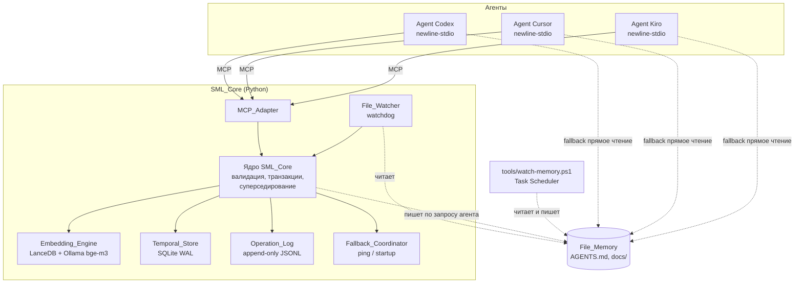
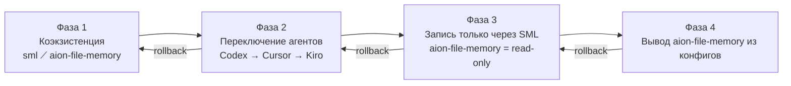

# Дизайн слоя общей памяти агентов

## 1. Введение

Этот документ описывает архитектуру Shared_Memory_Layer (далее SML) — единого stateful-слоя памяти для агентов Codex, Cursor, Kiro и любых будущих, работающих в инфраструктуре `D:\AionUi-Paperclip`. Документ опирается на требования из `.kiro/specs/agents-shared-memory-layer/requirements.md` и фиксирует выбор технологии, состав компонентов, модель данных, контракт MCP-инструментов, схему синхронизации с файловой памятью, правила безопасности, стратегию тестирования и план миграции.

SML строится как локальный процесс поверх Windows 11 и PowerShell 7. Он не заменяет файловый источник истины в `docs/` и `AGENTS.md` — он индексирует, связывает и ускоряет доступ к нему, добавляя семантический поиск на русском, учёт актуальности и сосуществование нескольких агентов в одном состоянии памяти. Документ расширяет уже работающий MCP-сервер `tools/aion_memory_mcp.py` и фоновый наблюдатель `tools/watch-memory.ps1` — всё новое встраивается в эту линию, а не строится параллельно.

Документ структурирован следующим образом. Разделы 1–5 задают рамки: введение, нефункциональные ограничения, сравнительный выбор технологии, high-level архитектуру и модель данных `Memory_Record`. Разделы 6–14 раскрывают контракт MCP, процесс синхронизации `File_Memory ↔ SML`, Temporal-модель и semantic search, политику безопасности, бюджет производительности, развёртывание на Windows, план миграции, свойства корректности для property-based testing и таблицу трассируемости «требование → компонент → проверка».

## 2. Нефункциональные ограничения

Эти ограничения применяются ко всем компонентам SML и ограничивают пространство технических решений до этапа сравнительного анализа.

- **Операционная среда — Windows 11 + PowerShell 7 Core.** Все команды администрирования и запуска пишутся для `pwsh.exe` из `C:\Program Files\PowerShell\7\pwsh.exe`. Это продиктовано уже установленной задачей Windows Task Scheduler `Aion File Memory Auto` и корректной обработкой русских UTF-8 строк [Req 14.4].
- **Полностью локальная работа.** Основной путь чтения и записи не инициирует исходящих сетевых запросов с содержимым `Memory_Record` или `Operation_Log` за пределы loopback-интерфейса [Req 10.4]. Облачные API допустимы только как опциональное расширение, отключённое по умолчанию, и не являются частью fallback-сценария [Req 12, Req 14.4].
- **Без обязательного Docker и без обязательной JVM.** Стек должен запускаться в процессах Python и локальных сервисов Windows без контейнеров. Это исключает тяжёлые серверы вроде Neo4j в варианте по умолчанию и сохраняет простоту развёртывания для единственного пользователя.
- **Русский язык данных и интерфейса.** Все текстовые поля `Memory_Record`, сообщения об ошибках MCP и журналы пишутся и возвращаются в UTF-8 без экранирования и транслитерации [Req 9.1–9.5]. Векторная модель и индекс должны работать с кириллицей без предварительного перевода [Req 5, Req 9.4].
- **Совместимость с существующими артефактами проекта.** SML не меняет формат `AGENTS.md`, `docs/current-context.md`, `docs/tasks.md`, `docs/decisions.md`, `docs/agent-log/`, `docs/handoffs/`, `docs/memory/layers/` и `docs/context-packs/context-pack-latest.md`. Все записи в эти файлы остаются человекочитаемыми и редактируемыми вручную [Req 8.1, Req 8.5, Req 13.2–13.4].
- **Источник истины — файл.** При любом расхождении между `Memory_Record` в SML и содержимым файла из `File_Memory` приоритет имеет файл [Req 8.1, Req 8.3]. SML — это индекс и ускоритель, а не независимое хранилище.
- **Фоновый наблюдатель `tools/watch-memory.ps1` и задача `Aion File Memory Auto` продолжают работать.** Файловые блокировки SML не превышают 5 секунд на операцию и допускают до 3 повторов при конфликте [Req 14.1–14.3].
- **Типичный объём базы — до 10 000 `Memory_Record` и до 200 МБ индекса.** Все лимиты времени ответа (500 мс для `Semantic_Query` на 20 первых результатов, 200 мс для чтения по идентификатору, 1 с для стартового контекстного пакета) гарантируются только в этих границах [Req 11.1–11.3, Req 11.5].
- **Взаимозаменяемость агентов.** Контракт MCP единообразен для Codex, Cursor и Kiro: одинаковые имена, параметры, форматы ответа [Req 1.4, Req 7.3–7.4]. Никакой логики, завязанной на конкретного агента, в слое нет.
- **Секреты не попадают в индекс.** Содержимое, распознанное как API-ключ, токен или пароль, отклоняется на входе и не доходит до хранилища [Req 10.2].

## 3. Выбор технологии — сравнительный анализ

Рассмотрены пять реалистичных путей реализации SML. Оценка выполнена по требованиям спеки, а не по абстрактной «мощности» решения.

### 3.1 Сравнительная таблица кандидатов

| Критерий                                              | Letta (stateful-сервер, shared memory blocks) | Graphiti (Zep) + Neo4j + Ollama | Basic Memory / markdown-vault-mcp | Mem0 self-hosted (extraction-first) | Композиция: Python MCP + SQLite + LanceDB + Ollama (bge-m3) |
| ----------------------------------------------------- | --------------------------------------------- | ------------------------------- | --------------------------------- | ----------------------------------- | ----------------------------------------------------------- |
| Единое состояние между агентами [Req 2]               | Да, это целевой режим                         | Да, через общий Neo4j           | Частично, через общие файлы       | Да, через общую БД                  | Да, через общий SQLite и LanceDB                            |
| Временные запросы и суперседирование [Req 6]          | Частично, через memory blocks                 | Да, это ключевая способность    | Слабо, только файловый timestamp  | Частично, без явного supersedes     | Да, реализуется явной supersedes-цепочкой в SQLite          |
| Семантический поиск на русском [Req 5, Req 9]         | Зависит от выбранного эмбеддера               | Сильно, при bge-m3 в Ollama     | Слабо, опирается на внешний поиск | Средне, зависит от LLM              | Сильно, bge-m3 напрямую работает с кириллицей               |
| Сосуществование с `File_Memory` как источником истины [Req 8] | Слабо, файлы вторичны                 | Слабо, граф вторичен не является | Сильно, файлы = источник истины   | Средне, индекс вторичен             | Сильно, файлы = источник истины, индекс перестраивается     |
| Fallback без SML [Req 12]                             | Нет, агент без сервера теряет память          | Нет, без Neo4j граф недоступен  | Да, файлы читаются напрямую       | Нет, без БД индекс недоступен       | Да, файлы читаются напрямую независимо от индекса           |
| Windows-развёртывание без Docker [Req 14.4]           | Средне, нужен отдельный сервер Letta          | Плохо, Neo4j требует JVM/Docker | Отлично, только файлы и Python    | Средне, требует Postgres/pgvector   | Отлично, pip install + ollama pull                          |
| Сложность интеграции (1 — просто, 5 — сложно)         | 4                                             | 5                               | 2                                 | 4                                   | 3                                                           |

### 3.2 Решение

**Выбрана композиция: Python-процесс `SML_Core` на базе существующего `tools/aion_memory_mcp.py` + SQLite для метаданных и supersedes-цепочки + LanceDB как встроенное векторное хранилище + Ollama с моделью `bge-m3` как эмбеддер русского языка.**

Обоснование через требования:

- Letta и Mem0 фиксируют собственное состояние и относятся к файлам как к вторичному источнику — это конфликтует с [Req 8.1] и [Req 8.3], где `File_Memory` назван авторитетным источником истины. В выбранной композиции файл остаётся первичным, а SQLite и LanceDB пересобираются из него при расхождении [Req 8.3, Req 14.2].
- Graphiti + Neo4j закрывают [Req 6] лучше других, но Neo4j требует JVM и на Windows устанавливается в одну из трёх сред: Docker, отдельный Windows Service или bundled Desktop. Все три противоречат ограничению «без обязательного Docker и без обязательной JVM» и усложняют [Req 14.4]. Temporal-логика достаточно простая — supersedes через поля `supersedes_id` и `superseded_by_id` и явный флаг `is_current`. Это реализуется в SQLite без отдельного графа.
- Basic Memory ближе всех по философии к [Req 8], но её семантический поиск опирается на внешние индексы и не даёт гарантий на русском. Выбранная композиция берёт принцип «файл = источник истины» от Basic Memory и добавляет bge-m3 поверх LanceDB — встроенного векторного хранилища, не требующего внешних процессов.
- Mem0 хорош для автоматического извлечения фактов, но его extraction-first-подход требует LLM в цикле записи, что на локальной машине добавляет нагрузку и не необходимо: `Memory_Record` приходят из `File_Memory` и из прямых вызовов MCP от агентов, где структура уже известна.
- Ollama на Windows имеет нативный installer и работает как локальная служба. Модель `bge-m3` мультиязычная, выдаёт векторы 1024 измерений и покрывает русский без предварительного перевода [Req 5, Req 9.4]. LanceDB работает встроенно в процессе Python без отдельного сервиса и даёт ANN-поиск, достаточный для Typical_Volume = 10 000 `Memory_Record` в пределах [Req 11.1–11.3].
- SQLite уже есть в Python-стандарте, поддерживает WAL-режим и атомарные транзакции, что важно для суперседирования в одну атомарную операцию [Req 6.2] и для `Operation_Log` в режиме append-only [Req 10.3].
- Композиция минимально расширяет существующий `tools/aion_memory_mcp.py`: тот же процесс, тот же newline-stdio транспорт, та же локаль [Req 1.2, Req 1.5], — и не требует отдельного сервера, который нужно держать запущенным.

Эта композиция рассматривается как единый стек; все компоненты входят в один Python-процесс `SML_Core` и управляются как одно целое.

## 4. High-Level Architecture

### 4.1 Компоненты

- **SML_Core.** Главный Python-процесс, принимающий MCP-запросы через newline-stdio и координирующий все операции чтения и записи `Memory_Record`. Реализует транзакционную логику записи, суперседирование и проверки границ полей. Выполняет роль единой точки входа и гарантирует единое состояние между агентами [Req 1.1, Req 2.1, Req 2.3, Req 4.2, Req 4.3].
- **MCP_Adapter.** Подмодуль `SML_Core`, отвечающий за newline-stdio транспорт MCP_Protocol и маппинг JSON-RPC-запросов в вызовы внутренних функций. Публикует единый набор инструментов с идентичными именами и сигнатурами для Codex, Cursor и Kiro и корректно сопоставляет `id` запроса и `id` ответа [Req 1.2, Req 1.4, Req 1.5, Req 1.6].
- **File_Watcher.** Наблюдатель файловой системы поверх `watchdog` на Python. Слушает изменения в `AGENTS.md`, `docs/current-context.md`, `docs/tasks.md`, `docs/decisions.md`, `docs/agent-log/`, `docs/handoffs/`, `docs/memory/layers/`, `docs/context-packs/context-pack-latest.md`. При изменении в течение 60 секунд вызывает переиндексацию соответствующих `Memory_Record` и разрешает конфликты в пользу файла [Req 8.2, Req 8.3, Req 14.1, Req 14.2]. Сосуществует с `tools/watch-memory.ps1` через короткие файловые блокировки.
- **Embedding_Engine.** Модуль, отвечающий за расчёт векторов `embedding_vector` и за ANN-поиск. Использует Ollama с моделью `bge-m3` для расчёта эмбеддингов и LanceDB как встроенное векторное хранилище. Возвращает результаты `Semantic_Query` с метрикой релевантности в диапазоне 0.0–1.0 и отсекает записи ниже порога 0.5 [Req 5.3, Req 5.4, Req 5.5, Req 5.6, Req 9.4].
- **Temporal_Store.** SQLite-база, хранящая поля `Memory_Record` за исключением вектора: идентификатор, тип, содержимое, автор, метки времени, флаг актуальности, `supersedes_id`, `superseded_by_id`, `source_file`, `source_lines`, `tags`. Реализует атомарное суперседирование в одной транзакции и поддерживает `Temporal_Query` по состоянию на заданную метку времени [Req 6.1, Req 6.2, Req 6.4, Req 6.5].
- **Operation_Log.** Модуль журналирования всех операций чтения, записи и удаления `Memory_Record` в режиме append-only. Пишет в отдельный файл `logs/operation-log.ndjson` в каталоге проекта, одна запись на строку, UTC ISO 8601 с точностью до секунды, формат JSONL. Записи удерживаются не менее 30 календарных дней [Req 10.1, Req 10.3]. Доступен для чтения средствами ОС без запущенного SML [Req 10.3].
- **Fallback_Coordinator.** Тонкий модуль, предоставляющий операцию `ping` проверки доступности с таймаутом 2 секунды и логику быстрого старта после перезапуска SML за 30 секунд [Req 3.3, Req 12.3, Req 12.4]. На стороне агента fallback реализуется самим MCP-клиентом агента (он переходит в `Fallback_Mode` по таймауту 5 секунд и опрашивает `ping` каждые 30 секунд), поэтому `Fallback_Coordinator` отвечает только за серверную сторону этой процедуры [Req 12.1, Req 12.5].

### 4.2 Диаграмма компонентов



### 4.3 Основные потоки данных

- **Запись `Memory_Record` от агента.** Агент вызывает MCP-инструмент `sml.write`. `MCP_Adapter` передаёт запрос в ядро `SML_Core`, которое валидирует границы полей [Req 4.2, Req 4.3], проверяет отсутствие секретов в содержимом [Req 10.2], в одной транзакции пишет запись в `Temporal_Store` и, при наличии `supersedes_id`, атомарно помечает предыдущие записи как неактуальные [Req 6.2]. Затем `Embedding_Engine` рассчитывает вектор через Ollama и пишет его в LanceDB. `Operation_Log` добавляет запись о факте записи [Req 10.1]. Если операция требует отражения в файле (`docs/agent-log/`, `docs/decisions.md`, `docs/tasks.md`, `docs/memory/layers/`), ядро вызывает соответствующий writer и фиксирует `source_file` и `source_lines` в записи [Req 8.4, Req 8.5, Req 13.2–13.4]. Только после успешного `fsync` на диск ядро возвращает агенту подтверждение `Commit` [Req 3.1, Req 3.5].
- **Чтение через `Semantic_Query`.** Агент вызывает `sml.semantic_query` с русским текстом. `Embedding_Engine` считает вектор запроса через ту же модель `bge-m3`, выполняет ANN-поиск в LanceDB, возвращает кандидатов со score ≥ 0.5 [Req 5.6], подтягивает метаданные из `Temporal_Store`, по умолчанию исключает записи с `is_current = false` [Req 6.6] и возвращает до 50 результатов, отсортированных по убыванию релевантности [Req 5.3]. `Operation_Log` фиксирует факт чтения [Req 10.1].
- **Синхронизация `File_Memory ↔ SML`.** `File_Watcher` получает событие об изменении файла в `File_Memory`. Ядро вычисляет diff строк, обновляет соответствующие `Memory_Record` в `Temporal_Store`, пересчитывает вектор в `Embedding_Engine`, обновляет `source_lines`, пишет запись в `Operation_Log` и в журнал синхронизации. Если файл изменён вручную и отличается от индекса — версия файла объявляется истинной, запись в SML приводится к файлу [Req 8.3]. При конфликте с `tools/watch-memory.ps1` применяется короткая файловая блокировка с повторами до трёх раз [Req 14.1, Req 14.3].

## 5. Модель данных Memory_Record

`Memory_Record` — единица хранения SML. Все поля хранятся в UTF-8 без перекодирования [Req 9.1, Req 9.2]. Метки времени — ISO 8601 с точностью до миллисекунд в часовом поясе UTC, формат `YYYY-MM-DDTHH:MM:SS.sssZ` [Req 6.1]. Границы длины текстовых полей продиктованы требованиями и проверяются на входе [Req 4.2, Req 4.3].

### 5.1 Схема полей

| Поле                   | Тип                            | Обязательность          | Границы / формат                                                                                          | Ссылки на требования |
| ---------------------- | ------------------------------ | ----------------------- | --------------------------------------------------------------------------------------------------------- | -------------------- |
| `id`                   | string (UUIDv7)                | обязательное            | каноническая форма UUID длиной 36 символов, присваивается `SML_Core` при записи                           | Req 4.2              |
| `type`                 | enum                           | обязательное            | одно из значений из 5.2                                                                                   | Req 4.1, Req 4.3     |
| `content`              | string                         | обязательное            | длина 1–10000 символов UTF-8; пробельные-только значения запрещены                                        | Req 4.2, Req 4.3, Req 9.1 |
| `author_agent`         | string                         | обязательное            | длина 1–128 символов UTF-8; ожидаемые значения: `codex`, `cursor`, `kiro` или имя будущего агента          | Req 4.2, Req 10.1    |
| `created_at`           | string (ISO 8601 UTC, ms)      | обязательное            | формат `YYYY-MM-DDTHH:MM:SS.sssZ`, часовой пояс UTC, точность до миллисекунд                              | Req 6.1, Req 4.2     |
| `updated_at`           | string (ISO 8601 UTC, ms)      | обязательное            | тот же формат; при создании равно `created_at`; обновляется при любой модификации или суперседировании    | Req 6.1, Req 6.2     |
| `is_current`           | boolean                        | обязательное            | `true` при создании; переводится в `false` атомарно при суперседировании                                  | Req 6.1, Req 6.2     |
| `supersedes_id`        | string (UUIDv7) или `null`     | опциональное            | ссылается на существующий `Memory_Record`; при отсутствии такого `id` запись отклоняется                   | Req 6.2, Req 6.3     |
| `superseded_by_id`     | string (UUIDv7) или `null`     | опциональное (производное) | заполняется автоматически в суперседируемой записи в рамках той же транзакции                          | Req 6.2, Req 6.7     |
| `source_file`          | string или `null`              | опциональное            | относительный путь от корня `D:\AionUi-Paperclip`, например `docs/decisions.md`                            | Req 8.4, Req 13.2–13.4 |
| `source_lines`         | string или `null`              | опциональное            | формат `начальная_строка-конечная_строка`, обе границы — положительные целые, `начальная ≤ конечная`      | Req 8.4              |
| `tags`                 | array of string                | опциональное            | 0–20 тегов, каждый 1–64 символа UTF-8, без дубликатов                                                     | Req 4.4, Req 5       |
| `embedding_vector`     | array of float32 (1024)        | производное             | рассчитывается `Embedding_Engine` через `bge-m3`; хранится в LanceDB, а не в SQLite                       | Req 5.3, Req 5.5     |
| `relevance_score_last` | float или `null`               | производное, транзиентное | значение 0.0–1.0 с точностью не менее трёх знаков после запятой; заполняется только в ответе на запрос | Req 5.4, Req 5.6     |

Поле `embedding_vector` физически живёт в LanceDB и связывается с записью через `id`; в SQLite оно не дублируется. Поле `relevance_score_last` не сохраняется в базе — оно появляется только в ответе конкретного `Semantic_Query`, чтобы не путать с историей релевантности.

### 5.2 Поддерживаемые типы `Memory_Record`

SML поддерживает восемь типов, ровно совпадающих с [Req 4.1]:

1. **факт** — устойчивое утверждение о проекте, среде, пользователе или коде. Пример: «MCP-сервер `aion-file-memory` подключён в Codex, Cursor и Kiro». Долгоживущий, пополняется в `docs/memory/layers/facts.md`.
2. **предпочтение** — установка пользователя, влияющая на стиль работы. Пример: «Ответы вести на русском языке». Отражается в `docs/memory/layers/preferences.md`.
3. **решение** — зафиксированное архитектурное или организационное решение. Пример: «SML использует композицию SQLite + LanceDB + Ollama bge-m3». Отражается в `docs/decisions.md` [Req 13.3].
4. **запись журнала** — отчёт агента о конкретной сессии работы. Пример: «Kiro перезаписал requirements.md для bitrix24-automation-hygiene». Отражается в файле каталога `docs/agent-log/` [Req 13.2].
5. **задача** — единица работы из `docs/tasks.md` с состоянием и ответственным.
6. **связь между задачами** — ребро «зависит от / блокирует / дубликат», соединяющее две задачи через `supersedes_id`-подобный механизм, но в поле связей. Хранится как `Memory_Record` типа «связь», содержащий идентификаторы связанных задач и вид связи [Req 4.4].
7. **ограничение** — лимит, запрет или условие, действующее в проекте. Пример: «Не использовать Docker в основном пути». Отражается в `docs/memory/layers/constraints.md`.
8. **таймлайн-событие** — датированное событие, важное для хронологии работы. Пример: «2026-05-10 — переезд рабочей папки на `D:\AionUi-Paperclip`». Отражается в `docs/memory/layers/timeline.md`.

Любой тип, не входящий в этот список, отклоняется при записи с ошибкой валидации [Req 4.3], состояние хранилища при этом не меняется.

## 6. MCP-контракт

SML публикует через `MCP_Adapter` фиксированный набор инструментов. Имена, параметры и форматы ответа одинаковы для Codex, Cursor и Kiro [Req 1.2, Req 1.4]. Все тексты — в UTF-8 [Req 9.1–9.3]. Сообщения об ошибках — на русском языке с категорией причины [Req 9.3, Req 2.5]. Каждая операция пишет запись в `Operation_Log` не позднее 1 секунды после завершения [Req 10.1].

Общий формат ответа об ошибке:

```json
{
  "ok": false,
  "error": {
    "category": "validation | not_found | conflict | secret_rejected | io_error | timeout | unsupported",
    "message": "Причина отказа на русском языке",
    "operation_id": "2026-05-11T11:09:12.345Z-sml-42"
  }
}
```

### 6.1 sml.write — добавить Memory_Record [Req 4.2, Req 4.3, Req 3.1, Req 6.2]

Назначение: зафиксировать новую запись в `Temporal_Store`, рассчитать эмбеддинг и при необходимости атомарно суперседировать предыдущие записи.

Схема входа:

```json
{
  "$schema": "http://json-schema.org/draft-07/schema#",
  "title": "sml.write.input",
  "type": "object",
  "required": ["type", "content", "author_agent"],
  "additionalProperties": false,
  "properties": {
    "type": {
      "type": "string",
      "enum": ["fact", "preference", "decision", "agent_log", "task", "task_link", "constraint", "timeline_event"]
    },
    "content": { "type": "string", "minLength": 1, "maxLength": 10000 },
    "author_agent": { "type": "string", "minLength": 1, "maxLength": 128 },
    "tags": {
      "type": "array",
      "items": { "type": "string", "minLength": 1, "maxLength": 64 },
      "maxItems": 20,
      "uniqueItems": true
    },
    "supersedes_id": { "type": ["string", "null"], "pattern": "^[0-9a-fA-F-]{36}$" },
    "source_file": { "type": ["string", "null"] },
    "source_lines": { "type": ["string", "null"], "pattern": "^[0-9]+-[0-9]+$" }
  }
}
```

Схема выхода:

```json
{
  "title": "sml.write.output",
  "type": "object",
  "required": ["ok", "id", "created_at", "is_current"],
  "properties": {
    "ok": { "const": true },
    "id": { "type": "string" },
    "created_at": { "type": "string" },
    "updated_at": { "type": "string" },
    "is_current": { "const": true },
    "supersedes_id": { "type": ["string", "null"] }
  }
}
```

Ошибки: `validation` (нарушены границы полей), `unsupported` (неизвестный `type`), `not_found` (неизвестный `supersedes_id` [Req 6.3]), `secret_rejected` (в `content` найден секрет [Req 10.2]), `io_error` (сбой записи на диск [Req 3.5]), `conflict` (коллизия суперседирования).

Пример вызова:

```json
{
  "tool": "sml.write",
  "arguments": {
    "type": "decision",
    "content": "SML использует композицию SQLite + LanceDB + Ollama bge-m3.",
    "author_agent": "kiro",
    "tags": ["sml", "architecture"],
    "source_file": "docs/decisions.md",
    "source_lines": "42-48"
  }
}
```

Пример ответа:

```json
{
  "ok": true,
  "id": "018f7a2c-1234-7abc-9def-0123456789ab",
  "created_at": "2026-05-11T11:09:12.345Z",
  "updated_at": "2026-05-11T11:09:12.345Z",
  "is_current": true,
  "supersedes_id": null
}
```

### 6.2 sml.read — получить Memory_Record по id [Req 2.6, Req 11.3]

Назначение: вернуть полный объект `Memory_Record` по идентификатору или признак отсутствия за ≤200 мс при Typical_Volume.

Схема входа:

```json
{
  "title": "sml.read.input",
  "type": "object",
  "required": ["id"],
  "additionalProperties": false,
  "properties": {
    "id": { "type": "string", "pattern": "^[0-9a-fA-F-]{36}$" }
  }
}
```

Схема выхода:

```json
{
  "title": "sml.read.output",
  "type": "object",
  "required": ["ok"],
  "properties": {
    "ok": { "type": "boolean" },
    "record": {
      "type": "object",
      "required": ["id", "type", "content", "author_agent", "created_at", "updated_at", "is_current"],
      "properties": {
        "id": { "type": "string" },
        "type": { "type": "string" },
        "content": { "type": "string" },
        "author_agent": { "type": "string" },
        "created_at": { "type": "string" },
        "updated_at": { "type": "string" },
        "is_current": { "type": "boolean" },
        "supersedes_id": { "type": ["string", "null"] },
        "superseded_by_id": { "type": ["string", "null"] },
        "source_file": { "type": ["string", "null"] },
        "source_lines": { "type": ["string", "null"] },
        "tags": { "type": "array", "items": { "type": "string" } }
      }
    },
    "found": { "type": "boolean" }
  }
}
```

Ошибки: `validation` (неверный формат `id`), `not_found` (`id` существует, но был удалён).

Пример вызова и ответа:

```json
{ "tool": "sml.read", "arguments": { "id": "018f7a2c-1234-7abc-9def-0123456789ab" } }
```

```json
{
  "ok": true,
  "found": true,
  "record": {
    "id": "018f7a2c-1234-7abc-9def-0123456789ab",
    "type": "decision",
    "content": "SML использует композицию SQLite + LanceDB + Ollama bge-m3.",
    "author_agent": "kiro",
    "created_at": "2026-05-11T11:09:12.345Z",
    "updated_at": "2026-05-11T11:09:12.345Z",
    "is_current": true,
    "supersedes_id": null,
    "superseded_by_id": null,
    "source_file": "docs/decisions.md",
    "source_lines": "42-48",
    "tags": ["sml", "architecture"]
  }
}
```

### 6.3 sml.semantic_query — семантический поиск [Req 5.1–5.6, Req 11.1, Req 13.1]

Назначение: вернуть до 50 `Memory_Record`, отсортированных по убыванию близости к русскоязычному запросу, с `relevance_score_last ≥ 0.5`.

Схема входа:

```json
{
  "title": "sml.semantic_query.input",
  "type": "object",
  "required": ["query"],
  "additionalProperties": false,
  "properties": {
    "query": { "type": "string", "minLength": 1, "maxLength": 1000 },
    "limit": { "type": "integer", "minimum": 1, "maximum": 50, "default": 20 },
    "include_superseded": { "type": "boolean", "default": false },
    "type_filter": {
      "type": "array",
      "items": { "type": "string" },
      "maxItems": 8
    }
  }
}
```

Схема выхода:

```json
{
  "title": "sml.semantic_query.output",
  "type": "object",
  "required": ["ok", "results"],
  "properties": {
    "ok": { "const": true },
    "results": {
      "type": "array",
      "maxItems": 50,
      "items": {
        "type": "object",
        "required": ["record", "relevance_score"],
        "properties": {
          "record": { "type": "object" },
          "relevance_score": { "type": "number", "minimum": 0.0, "maximum": 1.0 },
          "superseded_by_id": { "type": ["string", "null"] }
        }
      }
    },
    "degraded": { "type": "boolean" }
  }
}
```

Ошибки: `validation` (пустая строка, только пробелы, >1000 символов [Req 5.2]), `timeout` (превышен лимит [Req 11.4]).

Пример вызова:

```json
{
  "tool": "sml.semantic_query",
  "arguments": { "query": "как устроена локальная MCP-память", "limit": 5 }
}
```

Пример ответа:

```json
{
  "ok": true,
  "degraded": false,
  "results": [
    {
      "record": { "id": "018f7a2c-...", "type": "fact", "content": "MCP-сервер aion-file-memory подключён.", "author_agent": "codex", "created_at": "2026-05-10T12:00:00.000Z", "updated_at": "2026-05-10T12:00:00.000Z", "is_current": true },
      "relevance_score": 0.812
    }
  ]
}
```

### 6.4 sml.temporal_query — запрос на метку времени [Req 6.4, Req 6.5]

Назначение: вернуть состояние набора `Memory_Record` на указанную метку времени.

Схема входа:

```json
{
  "title": "sml.temporal_query.input",
  "type": "object",
  "required": ["at"],
  "additionalProperties": false,
  "properties": {
    "at": { "type": "string", "description": "ISO 8601 UTC, точность до миллисекунд" },
    "filter": {
      "type": "object",
      "properties": {
        "type": { "type": "string" },
        "tags": { "type": "array", "items": { "type": "string" } },
        "only_current_at": { "type": "boolean", "default": true }
      }
    },
    "limit": { "type": "integer", "minimum": 1, "maximum": 500, "default": 100 }
  }
}
```

Схема выхода:

```json
{
  "title": "sml.temporal_query.output",
  "type": "object",
  "required": ["ok", "records"],
  "properties": {
    "ok": { "const": true },
    "records": { "type": "array", "items": { "type": "object" } },
    "at": { "type": "string" }
  }
}
```

Ошибки: `validation` (`at` в будущем или раньше первой записи [Req 6.5]).

Пример:

```json
{ "tool": "sml.temporal_query", "arguments": { "at": "2026-05-10T12:00:00.000Z", "limit": 50 } }
```

```json
{ "ok": true, "at": "2026-05-10T12:00:00.000Z", "records": [] }
```

### 6.5 sml.supersede — пометить запись устаревшей [Req 6.2, Req 6.3]

Назначение: атомарно пометить одну или несколько записей как неактуальные и связать их с новой актуальной.

Схема входа:

```json
{
  "title": "sml.supersede.input",
  "type": "object",
  "required": ["new_id", "old_ids"],
  "additionalProperties": false,
  "properties": {
    "new_id": { "type": "string", "pattern": "^[0-9a-fA-F-]{36}$" },
    "old_ids": {
      "type": "array",
      "items": { "type": "string", "pattern": "^[0-9a-fA-F-]{36}$" },
      "minItems": 1,
      "maxItems": 50,
      "uniqueItems": true
    }
  }
}
```

Схема выхода:

```json
{
  "title": "sml.supersede.output",
  "type": "object",
  "required": ["ok", "updated_ids"],
  "properties": {
    "ok": { "const": true },
    "updated_ids": { "type": "array", "items": { "type": "string" } },
    "updated_at": { "type": "string" }
  }
}
```

Ошибки: `not_found` (`new_id` или хотя бы один `old_id` отсутствует — в этом случае ни одно из изменений не применяется [Req 6.3]), `conflict` (`old_id` уже имеет `superseded_by_id`), `io_error`.

Пример:

```json
{
  "tool": "sml.supersede",
  "arguments": {
    "new_id": "018f7a2c-1234-7abc-9def-0123456789ab",
    "old_ids": ["018f5e01-aaaa-7bbb-8ccc-1111feedbeef"]
  }
}
```

```json
{
  "ok": true,
  "updated_ids": ["018f5e01-aaaa-7bbb-8ccc-1111feedbeef"],
  "updated_at": "2026-05-11T11:09:12.400Z"
}
```

### 6.6 sml.add_decision — добавить решение [Req 13.3]

Назначение: записать `Memory_Record` типа `decision` и одновременно добавить блок в `docs/decisions.md`, не теряя существующее содержимое файла. SLA ≤ 5 секунд.

Схема входа:

```json
{
  "title": "sml.add_decision.input",
  "type": "object",
  "required": ["title", "context", "decision", "author_agent"],
  "additionalProperties": false,
  "properties": {
    "title": { "type": "string", "minLength": 1, "maxLength": 200 },
    "context": { "type": "string", "minLength": 1, "maxLength": 4000 },
    "decision": { "type": "string", "minLength": 1, "maxLength": 4000 },
    "author_agent": { "type": "string", "minLength": 1, "maxLength": 128 },
    "tags": { "type": "array", "items": { "type": "string" }, "maxItems": 20 }
  }
}
```

Схема выхода:

```json
{
  "title": "sml.add_decision.output",
  "type": "object",
  "required": ["ok", "id", "source_file", "source_lines"],
  "properties": {
    "ok": { "const": true },
    "id": { "type": "string" },
    "source_file": { "const": "docs/decisions.md" },
    "source_lines": { "type": "string" }
  }
}
```

Ошибки: `validation`, `io_error` (файл недоступен — состояние файла не меняется [Req 13.5]), `secret_rejected`.

Пример:

```json
{
  "tool": "sml.add_decision",
  "arguments": {
    "title": "Выбор векторного стора для SML",
    "context": "Нужно встроенное решение без Docker и JVM.",
    "decision": "Используем LanceDB + Ollama bge-m3.",
    "author_agent": "kiro",
    "tags": ["sml", "vector-store"]
  }
}
```

```json
{
  "ok": true,
  "id": "018f7a2c-1234-7abc-9def-0123456789ab",
  "source_file": "docs/decisions.md",
  "source_lines": "120-138"
}
```

### 6.7 sml.add_log — добавить запись журнала [Req 13.2]

Назначение: записать `Memory_Record` типа `agent_log` и создать файл в `docs/agent-log/` по существующему формату. SLA ≤ 5 секунд.

Схема входа:

```json
{
  "title": "sml.add_log.input",
  "type": "object",
  "required": ["date", "author_agent", "request", "result"],
  "additionalProperties": false,
  "properties": {
    "date": { "type": "string", "description": "ISO 8601 UTC, точность до секунды" },
    "author_agent": { "type": "string", "minLength": 1, "maxLength": 128 },
    "request": { "type": "string", "minLength": 1, "maxLength": 4000 },
    "plan": { "type": "string", "maxLength": 4000 },
    "result": { "type": "string", "minLength": 1, "maxLength": 8000 },
    "changed_files": { "type": "array", "items": { "type": "string" }, "maxItems": 200 },
    "risks": { "type": "string", "maxLength": 2000 },
    "next_steps": { "type": "string", "maxLength": 2000 }
  }
}
```

Схема выхода:

```json
{
  "title": "sml.add_log.output",
  "type": "object",
  "required": ["ok", "id", "source_file"],
  "properties": {
    "ok": { "const": true },
    "id": { "type": "string" },
    "source_file": { "type": "string", "description": "Относительный путь вида docs/agent-log/ГГГГ-ММ-ДД-ЧЧММ-<agent>-<slug>.md" }
  }
}
```

Ошибки: `validation`, `io_error` (каталог недоступен — `Memory_Record` не создаётся [Req 13.5]), `secret_rejected`.

Пример:

```json
{
  "tool": "sml.add_log",
  "arguments": {
    "date": "2026-05-11T11:10:00Z",
    "author_agent": "kiro",
    "request": "Завершить дизайн SML.",
    "result": "Добавлены разделы 6-14 в design.md.",
    "changed_files": [".kiro/specs/agents-shared-memory-layer/design.md"]
  }
}
```

```json
{
  "ok": true,
  "id": "018f7a2d-5678-7abc-9def-0123456789ab",
  "source_file": "docs/agent-log/2026-05-11-1110-kiro-sml-design-complete.md"
}
```

### 6.8 sml.build_context_pack — пересобрать context-pack-latest [Req 13.4, Req 14.2]

Назначение: обновить файл `docs/context-packs/context-pack-latest.md` в формате, совместимом с `tools/watch-memory.ps1`. SLA ≤ 10 секунд.

Схема входа:

```json
{
  "title": "sml.build_context_pack.input",
  "type": "object",
  "additionalProperties": false,
  "properties": {
    "reason": { "type": "string", "maxLength": 200 }
  }
}
```

Схема выхода:

```json
{
  "title": "sml.build_context_pack.output",
  "type": "object",
  "required": ["ok", "source_file", "updated_at"],
  "properties": {
    "ok": { "const": true },
    "source_file": { "const": "docs/context-packs/context-pack-latest.md" },
    "updated_at": { "type": "string" },
    "sections_written": { "type": "integer", "minimum": 0 }
  }
}
```

Ошибки: `io_error` (файл или каталог недоступен — предыдущий файл не затрагивается [Req 13.5]), `conflict` (конфликт блокировки с `watch-memory.ps1`, уже исчерпаны 3 повтора [Req 14.1]).

Пример:

```json
{ "tool": "sml.build_context_pack", "arguments": { "reason": "after sml.add_decision" } }
```

```json
{
  "ok": true,
  "source_file": "docs/context-packs/context-pack-latest.md",
  "updated_at": "2026-05-11T11:10:12.000Z",
  "sections_written": 6
}
```

### 6.9 sml.startup_pack — стартовый контекстный пакет [Req 7.1–7.6, Req 11.2]

Назначение: вернуть 6 фиксированных разделов стартового пакета, одинаковых для любого агента.

Схема входа:

```json
{
  "title": "sml.startup_pack.input",
  "type": "object",
  "additionalProperties": false,
  "properties": {
    "max_log_entries": { "type": "integer", "minimum": 1, "maximum": 20, "default": 10 }
  }
}
```

Схема выхода:

```json
{
  "title": "sml.startup_pack.output",
  "type": "object",
  "required": ["ok", "sections", "complete"],
  "properties": {
    "ok": { "const": true },
    "complete": { "type": "boolean" },
    "sections": {
      "type": "object",
      "required": ["project_nature", "decisions", "active_tasks", "preferences", "constraints", "recent_logs"],
      "properties": {
        "project_nature": { "type": "array", "items": { "type": "object" } },
        "decisions": { "type": "array", "items": { "type": "object" } },
        "active_tasks": { "type": "array", "items": { "type": "object" } },
        "preferences": { "type": "array", "items": { "type": "object" } },
        "constraints": { "type": "array", "items": { "type": "object" } },
        "recent_logs": { "type": "array", "items": { "type": "object" } }
      }
    },
    "empty_sections": { "type": "array", "items": { "type": "string" } }
  }
}
```

Ошибки: `io_error`. При отсутствии данных в разделе он возвращается пустым массивом, а его имя попадает в `empty_sections` и `complete = false` [Req 7.5].

Пример:

```json
{ "tool": "sml.startup_pack", "arguments": { "max_log_entries": 10 } }
```

```json
{
  "ok": true,
  "complete": true,
  "empty_sections": [],
  "sections": {
    "project_nature": [ { "id": "...", "content": "..." } ],
    "decisions": [],
    "active_tasks": [],
    "preferences": [],
    "constraints": [],
    "recent_logs": []
  }
}
```

### 6.10 sml.ping — проверка доступности [Req 12.4]

Назначение: быстрая проверка живости SML со SLA ≤ 2 секунды.

Схема входа:

```json
{ "title": "sml.ping.input", "type": "object", "additionalProperties": false, "properties": {} }
```

Схема выхода:

```json
{
  "title": "sml.ping.output",
  "type": "object",
  "required": ["ok", "version", "uptime_seconds"],
  "properties": {
    "ok": { "const": true },
    "version": { "type": "string" },
    "uptime_seconds": { "type": "integer", "minimum": 0 },
    "records_total": { "type": "integer", "minimum": 0 },
    "degraded": { "type": "boolean" }
  }
}
```

Ошибки: недоступность трактуется на стороне агента как таймаут [Req 12.4], сервер в этом случае ничего не возвращает.

Пример:

```json
{ "tool": "sml.ping", "arguments": {} }
```

```json
{ "ok": true, "version": "sml-0.1.0", "uptime_seconds": 42, "records_total": 312, "degraded": false }
```

## 7. Синхронизация File_Memory ↔ SML

### 7.1 Поток File → SML (watcher)

1. `File_Watcher` (на `watchdog`) получает событие `on_modified` или `on_created` для файла из списка наблюдаемых каталогов.
2. Событие ставится в очередь с дебаунсом 500 мс, чтобы агрегировать несколько быстрых сохранений редактором в одно обновление.
3. Ядро `SML_Core` берёт короткую файловую блокировку на целевой файл длительностью ≤ 5 секунд; при конфликте с `tools/watch-memory.ps1` повторяет попытку до 3 раз с паузой 250 мс [Req 14.1, Req 14.3].
4. Ядро читает текущее содержимое файла, вычисляет diff против snapshot последнего успешного индексирования (хранится в `Temporal_Store` как хэш и набор `source_lines`).
5. Для каждого изменённого блока создаётся или обновляется `Memory_Record` соответствующего типа (маппинг в 7.4). `Embedding_Engine` пересчитывает вектор через `bge-m3` и пишет его в LanceDB.
6. Результат в `Temporal_Store` фиксируется в одной транзакции: обновление `updated_at`, пересохранение `source_lines`, индексация в LanceDB. Операция пишется в `Operation_Log` с категорией `sync_from_file`.
7. SLA обновления: ≤ 60 секунд с момента `on_modified` до видимости изменения через `sml.read` [Req 8.2]. Если ядро не укладывается в 60 секунд, `Memory_Record` остаётся в предыдущем состоянии, в журнале синхронизации регистрируется ошибка, операция повторяется до 3 раз [Req 14.3].

Разрешение конфликта содержимого — всегда в пользу файла: если текст `Memory_Record` в `Temporal_Store` отличается от соответствующего фрагмента файла, индекс приводится к файлу, факт расхождения фиксируется в `Operation_Log` с категорией `sync_conflict_file_wins` [Req 8.3].

### 7.2 Поток SML → File

Инициируется только явным вызовом одного из MCP-инструментов:

- `sml.add_log` создаёт файл `docs/agent-log/ГГГГ-ММ-ДД-ЧЧММ-<agent>-<slug>.md` по шаблону `docs/templates/agent-report.md` (дата, имя агента, запрос, план, результат, изменённые файлы, риски, следующие шаги). Формат существующего каталога не меняется [Req 13.2, Req 8.5].
- `sml.add_decision` дописывает блок в конец `docs/decisions.md`. Существующие строки файла не перезаписываются и не переупорядочиваются — только append [Req 13.3]. Возвращаемые `source_lines` указывают на диапазон нового блока.
- `sml.build_context_pack` формирует `docs/context-packs/context-pack-latest.md` из 6 разделов `sml.startup_pack` в том же заголовочном формате, что использует `tools/watch-memory.ps1`, чтобы наблюдатель мог дальше пересобирать пакет без поломки формата [Req 13.4, Req 14.2].

Во всех трёх случаях запись идёт атомарно: сначала создаётся временный файл в том же каталоге, выполняется `fsync`, затем `os.replace` переименовывает его в целевое имя. При любой ошибке IO целевой файл остаётся в состоянии, предшествовавшем вызову [Req 13.5]. Только после успешного `replace` создаётся соответствующий `Memory_Record` в `Temporal_Store`, а `Embedding_Engine` рассчитывает вектор.

Добавление/изменение файла в каталогах `docs/tasks.md` и `docs/memory/layers/` поддерживается как append через отдельный внутренний writer SML (без MCP-инструмента на Шаге 2 — ручное редактирование пользователем остаётся основным путём и подхватывается `File_Watcher` из 7.1) [Req 8.7].

### 7.3 Сосуществование с `tools/watch-memory.ps1`

SML и `watch-memory.ps1` работают независимо и параллельно:

- Оба пересобирают `docs/context-packs/context-pack-latest.md`: SML — по явному вызову `sml.build_context_pack` от агента, `watch-memory.ps1` — по файловому триггеру [Req 14.1].
- Все файловые блокировки SML — короткие, ≤ 5 секунд на операцию; при конфликте — до 3 повторов с паузой 250 мс [Req 14.1].
- Запись в целевой файл — всегда через `write-to-temp + os.replace`; это устраняет гонку «половинного файла».
- Если `watch-memory.ps1` уже пишет `context-pack-latest.md` в момент вызова `sml.build_context_pack`, SML ждёт освобождения блокировки (до 3×5 с), затем перечитывает актуальное содержимое и пересобирает заново поверх. При исчерпании повторов возвращается ошибка `conflict` и предыдущее состояние файла сохраняется [Req 14.3].

### 7.4 Маппинг «файл → тип Memory_Record»

| Путь / каталог                                 | Тип Memory_Record       | Правило разбиения на записи                                                  |
| ---------------------------------------------- | ----------------------- | ---------------------------------------------------------------------------- |
| `docs/memory/layers/facts.md`                  | `fact`                  | Одна запись на элемент маркированного списка или подзаголовок уровня 2–3     |
| `docs/memory/layers/preferences.md`            | `preference`            | Одна запись на элемент списка                                                |
| `docs/memory/layers/constraints.md`            | `constraint`            | Одна запись на элемент списка                                                |
| `docs/memory/layers/timeline.md`               | `timeline_event`        | Одна запись на датированный абзац                                            |
| `docs/decisions.md`                            | `decision`              | Одна запись на раздел уровня 2 («## Заголовок решения»)                       |
| `docs/tasks.md`                                | `task`                  | Одна запись на пункт чек-листа `- [ ]` / `- [x]`                              |
| `docs/agent-log/*.md`                          | `agent_log`             | Одна запись на файл целиком; `source_lines = 1-<EOF>`                         |
| `docs/current-context.md`                      | `fact` (с тегом `current`) | Одна запись на раздел уровня 2                                            |
| `docs/handoffs/*.md`                           | `agent_log` (с тегом `handoff`) | Одна запись на файл целиком                                          |

Связи между `task` и другими записями (`task_link`) создаются только через явный `sml.write` с `type = "task_link"`; автоматический разбор связей из текста Markdown на этом шаге не предусмотрен.

## 8. Temporal-модель и Semantic Search

### 8.1 Temporal-модель

Суперседирование реализуется полем `supersedes_id` в суперседирующей записи и зеркальным `superseded_by_id` в суперседируемой. Ядро `SML_Core` выполняет суперседирование в одной SQLite-транзакции в WAL-режиме: в пределах `BEGIN IMMEDIATE ... COMMIT` обновляются оба поля и `updated_at` обеих записей, а флаг `is_current` переводится атомарно (у новой записи — `true`, у старой — `false`) [Req 6.2]. Если любая из проверок падает (ссылочная целостность, ошибка IO), транзакция откатывается целиком — ни одно из полей не изменяется [Req 6.3].

Индексы в SQLite:

- `CREATE UNIQUE INDEX idx_records_id ON records(id);` — первичный ключ.
- `CREATE INDEX idx_records_current ON records(is_current, updated_at DESC);` — для «активного» среза.
- `CREATE INDEX idx_records_type_updated ON records(type, updated_at DESC);` — для запросов `sml.startup_pack` и `sml.temporal_query` по типу.
- `CREATE INDEX idx_records_supersedes ON records(supersedes_id);` — для обратных ссылок.
- `CREATE INDEX idx_records_source_file ON records(source_file);` — для быстрой синхронизации из файла.

`sml.temporal_query` с меткой `at` выполняется как `SELECT * FROM records WHERE created_at <= at AND (deleted_at IS NULL OR deleted_at > at) AND (<поле is_current_at_снапшот>)`. Для точной реконструкции «как было тогда» ядро поддерживает историческую таблицу `records_history` с парами `(id, from, to, is_current)`, заполняемую при каждом `UPDATE`. Запрос с меткой времени в будущем или раньше `MIN(created_at)` отклоняется как `validation` [Req 6.5].

### 8.2 Semantic Search

- Модель: `bge-m3` через Ollama, вектор размерности **1024**, мультиязычная, поддерживает русский без предварительного перевода [Req 5.5, Req 9.4].
- Индекс: LanceDB в встроенном режиме, ANN-индекс `IVF_HNSW` с параметрами `num_partitions = 64` и `M = 16` на старте (подстраивается при росте базы).
- Метрика: косинусная близость. Score нормируется в диапазон `[0.0, 1.0]` как `(1 + cos) / 2` и округляется до 3 знаков после запятой [Req 5.4].
- Порог релевантности: **0.5**. Записи со score ниже порога отбрасываются; при отсутствии кандидатов возвращается пустой список с `ok = true, results = []` [Req 5.6].
- Лимит результатов: не более **50** на вызов `sml.semantic_query` [Req 5.3]; `search_memory`-совместимый вызов (см. Раздел 6.3) по умолчанию возвращает до 20 [Req 13.1].
- По умолчанию из выдачи исключаются записи с `is_current = false` [Req 6.6]. Флаг `include_superseded = true` включает их с пометкой `superseded_by_id` [Req 6.7].

Шаг запроса: текст → эмбеддинг через Ollama (≈50 мс на локальной машине) → ANN-поиск в LanceDB (≈30 мс при 10 000 записей) → JOIN с `Temporal_Store` по `id` → фильтрация по `is_current` и `type_filter` → возврат. Суммарный бюджет ≤ 500 мс [Req 11.1].

## 9. Безопасность и Operation_Log

### 9.1 Детектор секретов

Двухуровневая проверка на входе `sml.write`, `sml.add_decision`, `sml.add_log`. При обнаружении секрета операция отклоняется с `category = "secret_rejected"`, `Memory_Record` не создаётся, в `Operation_Log` пишется `result = rejected` с категорией причины, самого значения секрета в журнале нет [Req 10.2].

**Уровень 1. Известные префиксы и паттерны.** Регулярные выражения (PCRE), проверяются по всему `content` без учёта регистра:

- `sk-[A-Za-z0-9]{20,}` — ключи OpenAI.
- `sk-ant-[A-Za-z0-9\-_]{20,}` — ключи Anthropic.
- `ghp_[A-Za-z0-9]{30,}` — GitHub personal access token.
- `gho_[A-Za-z0-9]{30,}` — GitHub OAuth token.
- `ghs_[A-Za-z0-9]{30,}` — GitHub app server token.
- `xox[baprs]-[A-Za-z0-9-]{10,}` — Slack tokens.
- `AKIA[0-9A-Z]{16}` — AWS Access Key ID.
- `aws_secret_access_key\s*=\s*[A-Za-z0-9/+=]{40}` — AWS secret.
- `AIza[0-9A-Za-z\-_]{35}` — Google API key.
- `ya29\.[0-9A-Za-z\-_]+` — Google OAuth token.
- `eyJ[A-Za-z0-9\-_=]+\.[A-Za-z0-9\-_=]+\.?[A-Za-z0-9\-_.+/=]*` — JWT.
- `-----BEGIN (RSA |EC |OPENSSH )?PRIVATE KEY-----` — PEM-ключи.
- `(?i)api[_-]?key\s*[:=]\s*['"]?[A-Za-z0-9\-_]{16,}['"]?` — пары «api_key=…».
- `(?i)(password|passwd|pwd)\s*[:=]\s*['"]?\S{8,}['"]?` — пары «password=…».
- `glpat-[A-Za-z0-9\-_]{20,}` — GitLab personal access token.

**Уровень 2. Шенноновская энтропия.** Для каждой подстроки длиной 20–200 символов, соответствующей классу `[A-Za-z0-9+/=_\-]`, считается энтропия Шеннона в битах на символ. Если энтропия ≥ **4.5 бит/символ**, подстрока считается кандидатом в секрет. Для снижения ложных срабатываний подстрока дополнительно проверяется на отсутствие в типовых словарях русских и английских слов (присутствие ≥ 3 словарных слов длиной ≥ 4 в подстроке считается против секрета).

Результат проверки фиксируется как категория причины: `pattern_match`, `high_entropy`.

### 9.2 Operation_Log

- Формат: **JSONL** (одна JSON-строка на запись, без пробелов и без BOM).
- Путь: `logs/sml-operation-log.ndjson` относительно корня `D:\AionUi-Paperclip`.
- Режим: **append-only**. Ротация — по календарным суткам: при первой операции нового UTC-дня текущий файл переименовывается в `logs/sml-operation-log-ГГГГ-ММ-ДД.ndjson`, открывается новый `sml-operation-log.ndjson` [Req 10.3].
- Удержание: не менее **30 календарных дней** с момента создания записи. Удаление старых файлов — раз в сутки в фоне.
- Доступность без SML: файл читается любым текстовым просмотрщиком/`tail`/`Get-Content -Tail` без запуска SML [Req 10.3].

Схема одной записи:

```json
{
  "ts": "2026-05-11T11:09:12Z",
  "agent": "kiro",
  "op": "write | read | delete | supersede | semantic_query | temporal_query | add_decision | add_log | build_context_pack | startup_pack | ping | sync_from_file | sync_conflict_file_wins",
  "record_id": "018f7a2c-1234-7abc-9def-0123456789ab",
  "result": "success | rejected | error",
  "reason_category": "validation | not_found | conflict | secret_rejected | io_error | timeout | unsupported | pattern_match | high_entropy | file_wins"
}
```

Поле `record_id` может отсутствовать для операций без конкретной цели (`ping`, `semantic_query`, `build_context_pack`). Поле `reason_category` обязательно для `result != success`.

### 9.3 Loopback-only

- Ollama настраивается на `127.0.0.1:11434` (значение `OLLAMA_HOST=127.0.0.1`); никаких внешних endpoints в коде SML нет.
- LanceDB работает встроенно в процессе Python; сетевой интерфейс не открывается.
- SQLite — локальный файл `var/sml/state.db`; без сетевого драйвера.
- MCP — только `newline-stdio` через stdin/stdout процесса SML [Req 1.5, Req 10.4]; сетевых сокетов `MCP_Adapter` не открывает.
- Контроль во время работы: SML не содержит вызовов `socket.create_connection` с адресами вне `127.0.0.1/::1`; это инвариант проверяется property-тестом P7.

## 10. Производительность

Все цифры — для Typical_Volume = 10 000 `Memory_Record` на локальной машине Windows 11 + PowerShell 7.

### 10.1 Бюджет по операциям

| Операция                  | Лимит по требованию | Бюджет компонентов                                                                   |
| ------------------------- | ------------------- | ------------------------------------------------------------------------------------ |
| `sml.read` [Req 11.3]     | ≤ 200 мс            | SQLite lookup ~5 мс + JSON-сериализация ~10 мс + stdio ~5 мс ⇒ запас ~180 мс         |
| `sml.semantic_query` [Req 11.1] | ≤ 500 мс      | Ollama embedding ~50 мс + ANN LanceDB ~30 мс + JOIN SQLite ~20 мс + IO ~20 мс ⇒ запас ~380 мс |
| `sml.startup_pack` [Req 11.2]   | ≤ 1000 мс     | 6 разделов × ~50 мс SQLite ≈ 300 мс + сериализация ~100 мс ⇒ запас ~600 мс           |
| `sml.write`               | ≤ 2000 мс [Req 4.2] / durable ≤ 5000 мс [Req 3.1] | Валидация ~10 мс + SQLite write+fsync ~50 мс + embedding ~50 мс + LanceDB write ~30 мс + IO ~20 мс ⇒ запас ~1800 мс |
| `sml.supersede`           | ≤ 2000 мс           | Одна транзакция SQLite ~80 мс + Operation_Log ~10 мс ⇒ запас ~1900 мс                |
| `sml.ping` [Req 12.4]     | ≤ 2000 мс           | Чтение счётчиков из памяти ~5 мс ⇒ запас ~1990 мс                                    |
| `sml.build_context_pack` [Req 13.4] | ≤ 10 000 мс | Чтение 6 разделов ~300 мс + рендер + atomic write ~100 мс + блокировка до 3×5 с     |

### 10.2 Стратегия при превышении Typical_Volume

Если `records_total > 10 000`, SML продолжает отвечать, но флаг `degraded = true` возвращается в `sml.ping` и в ответе `sml.semantic_query`. Гарантии времени из Раздела 11 требований не действуют; операции завершаются корректно, целостность базы сохраняется [Req 11.5]. Агент видит флаг и может адаптировать стратегию (увеличить таймаут, снизить частоту вызовов).

При превышении лимита конкретной операции SML возвращает `category = "timeout"`, частичные данные не сохраняются, база остаётся целостной [Req 11.4].

### 10.3 Оценка размера индекса

- Вектор: 1024 × 4 байта = 4 КБ на запись.
- 10 000 записей × 4 КБ ≈ **40 МБ** «сырых» векторов.
- Оверхед LanceDB (метаданные, IVF_HNSW-структура): ≈ 2–2.5×, итого ≈ **100 МБ**.
- SQLite (`state.db`) при 10 000 записях с WAL и индексами: ≈ 15–25 МБ.
- Суммарный след на диске: ≈ **150 МБ**, укладывается в нефункциональный лимит «до 200 МБ индекса».

## 11. Развёртывание на Windows

### 11.1 Каталоги

```text
D:\AionUi-Paperclip\
├── tools\
│   ├── aion_memory_mcp.py            # существующий MCP-сервер (точка расширения)
│   ├── watch-memory.ps1              # существующий наблюдатель, сохраняется
│   └── sml\                          # НОВОЕ: код SML
│       ├── __init__.py
│       ├── core.py                   # SML_Core, транзакции, валидация
│       ├── mcp_adapter.py            # newline-stdio MCP-транспорт
│       ├── temporal_store.py         # SQLite (WAL) + history table
│       ├── embedding_engine.py       # Ollama bge-m3 + LanceDB
│       ├── file_watcher.py           # watchdog
│       ├── operation_log.py          # JSONL append-only + ротация
│       ├── security.py               # детектор секретов (regex + энтропия)
│       └── writers\                  # writer-ы для docs/decisions.md, agent-log, context-pack
├── var\
│   └── sml\
│       ├── state.db                  # SQLite
│       ├── state.db-wal              # WAL
│       ├── state.db-shm
│       └── lance\                    # LanceDB embedded storage
├── logs\
│   ├── sml-operation-log.ndjson
│   └── sml-operation-log-2026-05-11.ndjson
└── .kiro\ .cursor\ ~/.codex\         # MCP-клиентские конфиги (обновляются на миграции)
```

### 11.2 Запуск

SML поднимается как MCP-stdio-процесс клиентами агентов. Отдельный Windows Service не требуется. Фрагмент конфига:

```json
{
  "mcpServers": {
    "sml": {
      "command": "C:\\Program Files\\PowerShell\\7\\pwsh.exe",
      "args": [
        "-NoProfile",
        "-File", "D:\\AionUi-Paperclip\\tools\\sml\\start-sml.ps1"
      ],
      "transport": "stdio"
    }
  }
}
```

`start-sml.ps1` — тонкий wrapper, запускающий `python -X utf8 -m tools.sml.mcp_adapter` c `PYTHONUTF8=1` и `OLLAMA_HOST=127.0.0.1`, что обеспечивает UTF-8 в stdio и локальный Ollama [Req 9, Req 10.4, Req 14.4]. Конфиги обновляются в `~/.codex/config.toml`, `.cursor/mcp.json`, `.kiro/settings/mcp.json` — с одинаковыми именем и параметрами для всех трёх клиентов [Req 1.2, Req 1.4].

### 11.3 Зависимости

Python ≥ 3.11, устанавливается через pip в локальном venv `D:\AionUi-Paperclip\.venv-sml`:

```text
mcp
lancedb
sqlite-utils
watchdog
requests
pydantic
```

Ollama устанавливается отдельно через native Windows installer с сайта `ollama.com/download`; модель подтягивается командой `ollama pull bge-m3`. Ollama запускается как локальная служба и слушает только `127.0.0.1:11434` [Req 10.4].

Работа без сети: после первой установки Ollama и pip-зависимостей SML работает при отключённой сети — чтение и запись `Memory_Record` не требуют сетевых вызовов [Req 14.4].

### 11.4 Сосуществование с `tools/watch-memory.ps1`

- Оба процесса могут работать одновременно; их точки обновления — одни и те же файлы, но запись идёт через atomic replace и короткие блокировки [Req 14.1].
- SML не пытается остановить задачу `Aion File Memory Auto`; наоборот, задача продолжает пересобирать `context-pack-latest.md` независимо от наличия SML [Req 14.1].
- При конфликте блокировок до 3 повторов с паузой 250 мс; при окончательном конфликте возвращается `category = "conflict"` и предыдущее состояние сохраняется [Req 14.3].

## 12. План миграции с aion-file-memory

Миграция идёт в четыре фазы. В любой фазе допустим откат, потому что источником истины остаётся `File_Memory` в `docs/` и `AGENTS.md`.



**Фаза 1. Коэкзистенция.** SML регистрируется как новый MCP-сервер под именем `aion-file-memory-v2` (альтернативное короткое имя — `sml`). Оба сервера работают параллельно; агенты видят оба в своих конфигах. Проверочные критерии: `sml.ping` отвечает за ≤ 2 с; `sml.startup_pack` возвращает 6 разделов; параллельная запись в старый сервер и в SML не ломает файлы в `docs/`.

**Фаза 2. Переключение агентов по одному.** Codex → Cursor → Kiro. Для каждого: переключить дефолтный сервер памяти на `sml` в соответствующем конфиге (`~/.codex/config.toml`, `.cursor/mcp.json`, `.kiro/settings/mcp.json`); прогнать ключевые сценарии (`sml.semantic_query`, `sml.add_log`, `sml.add_decision`); наблюдать `Operation_Log` в течение ≥ 24 часов без ошибок категорий `io_error`/`conflict` для этого агента. Если наблюдается регресс — rollback к старой конфигурации агента, остальные остаются на SML.

**Фаза 3. Прекращение записи через старый сервер.** Все write-операции (`add_*`, `save_*`) направляются только в SML; старый `aion-file-memory` оставляется в конфигах только как источник чтения, его write-эндпоинты отключаются на стороне клиента (переопределяются no-op в обёртке MCP-клиента). Файлы в `docs/` продолжают быть авторитетным источником и обновляются SML через `sml.add_log` / `sml.add_decision`.

**Фаза 4. Вывод из эксплуатации.** Старый сервер удаляется из `~/.codex/config.toml`, `.cursor/mcp.json`, `.kiro/settings/mcp.json`. `tools/aion_memory_mcp.py` остаётся в репозитории как reference, но не запускается. `tools/watch-memory.ps1` и задача `Aion File Memory Auto` сохраняются без изменений.

Rollback-правило: в любой фазе агент может вернуться на предыдущую конфигурацию, и память не теряется, потому что все артефакты по-прежнему живут в файлах `docs/`. Индекс SML при необходимости пересобирается из `File_Memory` полным проходом `File_Watcher`.

## 13. Correctness Properties

*Свойство (property) — это утверждение о поведении системы, которое должно выполняться для всех валидных исполнений. Свойства — мост между человекочитаемой спецификацией и автоматически проверяемыми гарантиями корректности.*

### Property P1: Durability

*For all* `r ∈ Memory_Record`, успешно зафиксированных через `sml.write` с ответом `ok = true`, после любого перезапуска SML_Core (штатного или аварийного) вызов `sml.read(r.id)` возвращает запись, у которой поля `id`, `type`, `content`, `author_agent`, `created_at`, `updated_at`, `is_current`, `supersedes_id`, `source_file`, `source_lines`, `tags` побайтово совпадают со значениями, возвращёнными в исходном ответе `sml.write`.

**Validates: Requirements 3.1, 3.2, 3.3, 3.4, 3.5**

### Property P2: Read-After-Commit

*For all* пар `(a1, a2)` разных агентов и *for all* `r ∈ Memory_Record`, если агент `a1` получил `sml.write → ok = true` с идентификатором `r.id` в момент `t`, то любой вызов `sml.read(r.id)` агентом `a2` в момент `t' ≥ t + 2s` возвращает `found = true` и запись, идентичную по полям (см. P1) той, что была зафиксирована.

**Validates: Requirements 2.1, 2.2**

### Property P3: Monotonicity

*For all* `r ∈ Memory_Record` и *for all* последовательностей операций SML, не содержащих вызовов `sml.supersede(*, включающего r.id)` и не содержащих явного удаления `r`, запись `r.is_current` остаётся равной `true` на всём промежутке, а `r.content` и прочие сохранные поля не изменяются.

**Validates: Requirements 4.4, 4.6, 6.6**

### Property P4: File Authority

*For all* `r ∈ Memory_Record` с непустым `r.source_file` после завершения синхронизации `File_Watcher` (в пределах 60 секунд после `on_modified`), значение `r.content` равно тексту, извлечённому из `r.source_file` в диапазоне `r.source_lines`, с точностью до нормализации пробельных символов (`\r\n` → `\n`, trim trailing whitespace на строках). Если перед синхронизацией значения различались, расхождение отражено в `Operation_Log` с категорией `file_wins`.

**Validates: Requirements 8.1, 8.3, 8.7**

### Property P5: Supersede Atomicity

*For all* пар `(old, new)` `Memory_Record`, таких что вызван `sml.supersede(new_id = new.id, old_ids ⊇ {old.id})`: либо после завершения операции наблюдаются одновременно `new.is_current = true`, `old.is_current = false`, `old.superseded_by_id = new.id` и `new.supersedes_id` содержит `old.id`, либо ни одно из этих полей не изменилось относительно момента перед операцией, и в `Operation_Log` присутствует запись `result = error | rejected`.

**Validates: Requirements 6.2, 6.3**

### Property P6: Secret Leak Prevention

*For all* входов `x` операций записи (`sml.write`, `sml.add_decision`, `sml.add_log`), удовлетворяющих хотя бы одному из паттернов детектора секретов (Раздел 9.1) или имеющих подстроку длины 20–200 с энтропией Шеннона ≥ 4.5 бит/символ: после выполнения операции не существует `Memory_Record` в `Temporal_Store` или в LanceDB, чьё поле `content` содержит значение секрета `x`; `Operation_Log` содержит запись с `result = rejected` и `reason_category ∈ {pattern_match, high_entropy}`; соответствующий целевой файл (`docs/decisions.md`, `docs/agent-log/*.md`) не содержит `x`.

**Validates: Requirements 10.2**

### Property P7: No Network Leak

*For all* моментов времени `t` в интервале работы процесса SML, множество активных исходящих TCP-соединений процесса с удалёнными адресами, не принадлежащими `127.0.0.1/8` и `::1/128`, пусто.

**Validates: Requirements 10.4**

### Property P8: Semantic Query Determinism

*For all* пар `(Q, S)`, где `Q` — валидный текст `sml.semantic_query.input`, а `S` — состояние SML (набор `Memory_Record` и их эмбеддингов), два последовательных вызова `sml.semantic_query(Q)` без промежуточных операций записи и без изменений `S` возвращают идентичный отсортированный список `results` с одинаковыми `id` и одинаковыми значениями `relevance_score` (после округления до трёх знаков после запятой).

**Validates: Requirements 5.3, 5.4**

### Property P9: UTF-8 Fidelity

*For all* строк `s`, являющихся валидной последовательностью UTF-8 длиной 1–10000 кодовых точек (включая кириллицу, знаки пунктуации, эмодзи, комбинированные диакритики): если `sml.write({content = s, ...})` вернул `ok = true` с идентификатором `id`, то `sml.read(id).content` побайтово равно `s`.

**Validates: Requirements 9.1, 9.2, 9.5**

## 14. Трассируемость «требование → компонент → проверка»

| Требование | Acceptance Criteria | Компонент дизайна                                    | Correctness Property / Тест                                |
| ---------- | ------------------- | ---------------------------------------------------- | ---------------------------------------------------------- |
| Req 1      | 1.1                 | MCP_Adapter (4.1, 6)                                 | EXAMPLE: manifests MCP                                     |
| Req 1      | 1.2                 | MCP_Adapter (6)                                      | EXAMPLE: сравнение 3 конфигов                              |
| Req 1      | 1.3                 | MCP_Adapter, Fallback_Coordinator (4.1)              | SMOKE: handshake ≤ 5 с                                     |
| Req 1      | 1.4                 | MCP_Adapter (6)                                      | EXAMPLE: одинаковые manifests                              |
| Req 1      | 1.5                 | MCP_Adapter (4.1)                                    | PROPERTY: корреляция id запроса/ответа                     |
| Req 1      | 1.6                 | MCP_Adapter (4.1)                                    | EDGE_CASE: повреждённый кадр                               |
| Req 2      | 2.1                 | SML_Core, Temporal_Store (4.1, 4.3)                  | P2                                                         |
| Req 2      | 2.2                 | SML_Core, Temporal_Store                             | P2                                                         |
| Req 2      | 2.3                 | SML_Core транзакции (4.3)                            | PROPERTY: уникальные ms-метки при параллельных записях     |
| Req 2      | 2.4                 | Temporal_Store                                       | P3 (идемпотентность чтения без записи)                     |
| Req 2      | 2.5                 | SML_Core, Temporal_Store                             | P1, P5 (атомарность «всё или ничего»)                      |
| Req 2      | 2.6                 | SML_Core, sml.read (6.2)                             | EDGE_CASE: неизвестный id → `found = false`                |
| Req 3      | 3.1–3.5             | Temporal_Store (SQLite WAL) (4.1, 8.1)               | P1                                                         |
| Req 4      | 4.1                 | SML_Core валидация типов (5.2)                       | EXAMPLE: все 8 типов                                       |
| Req 4      | 4.2                 | SML_Core валидация, Temporal_Store                   | P1, PROPERTY: границы полей                                |
| Req 4      | 4.3                 | SML_Core валидация                                   | PROPERTY: невалидный вход → состояние неизменно            |
| Req 4      | 4.4                 | Temporal_Store, sml.write (6.1)                      | P3, EXAMPLE: связи                                         |
| Req 4      | 4.5                 | SML_Core валидация                                   | EDGE_CASE: несуществующий id связи                         |
| Req 4      | 4.6                 | Temporal_Store                                       | P3                                                         |
| Req 5      | 5.1                 | sml.semantic_query (6.3)                             | EDGE_CASE: границы длины                                   |
| Req 5      | 5.2                 | sml.semantic_query (6.3)                             | EDGE_CASE: пустая / пробельная / >1000                     |
| Req 5      | 5.3                 | Embedding_Engine, LanceDB (8.2)                      | P8, PROPERTY: сортировка, лимит 50, SLA 2 с                |
| Req 5      | 5.4                 | Embedding_Engine (8.2)                               | P8, PROPERTY: score ∈ [0,1] с точностью ≥3 знаков          |
| Req 5      | 5.5                 | Embedding_Engine bge-m3 (8.2)                        | EXAMPLE: Recall@10 на русскоязычных синонимах              |
| Req 5      | 5.6                 | Embedding_Engine порог 0.5 (8.2)                     | PROPERTY: при нерелевантном запросе — пустой список        |
| Req 6      | 6.1                 | Temporal_Store схема (5.1, 8.1)                      | PROPERTY: формат ISO 8601 UTC ms                           |
| Req 6      | 6.2                 | SML_Core транзакции, sml.supersede (6.5, 8.1)        | P5                                                         |
| Req 6      | 6.3                 | SML_Core валидация                                   | P5, EDGE_CASE: несуществующий supersedes_id                |
| Req 6      | 6.4                 | Temporal_Store records_history (8.1)                 | PROPERTY: реконструкция «как было тогда»                   |
| Req 6      | 6.5                 | sml.temporal_query валидация (6.4)                   | EDGE_CASE: метка в будущем / до первой записи              |
| Req 6      | 6.6                 | sml.semantic_query фильтр is_current (8.2)           | P3, PROPERTY: выдача не содержит is_current=false          |
| Req 6      | 6.7                 | sml.semantic_query флаг include_superseded (8.2)     | PROPERTY: при флаге — помечены superseded_by_id            |
| Req 7      | 7.1                 | sml.startup_pack (6.9)                               | SMOKE: SLA 5 с                                             |
| Req 7      | 7.2–7.4             | sml.startup_pack фикс. 6 разделов (6.9)              | PROPERTY: структура пакета + свежесть ≤30 дней             |
| Req 7      | 7.5                 | sml.startup_pack empty_sections (6.9)                | EDGE_CASE: пустые разделы помечены                         |
| Req 7      | 7.6                 | sml.startup_pack (6.9)                               | EDGE_CASE: fault injection, состояние неизменно            |
| Req 8      | 8.1                 | File_Watcher (4.1, 7.1)                              | P4                                                         |
| Req 8      | 8.2                 | File_Watcher SLA 60 с (7.1)                          | P4 (SLA), PROPERTY: SLA синхронизации                      |
| Req 8      | 8.3                 | SML_Core conflict policy (7.1)                       | P4                                                         |
| Req 8      | 8.4                 | Temporal_Store source_file/source_lines (5.1, 7.1)   | PROPERTY: формат source_lines                              |
| Req 8      | 8.5                 | writers/* (7.2)                                      | PROPERTY: сохранность формата файлов + блокировки ≤5 с     |
| Req 8      | 8.6                 | Fallback_Coordinator, File_Watcher                   | EDGE_CASE: SML отключён → File_Memory доступна             |
| Req 8      | 8.7                 | File_Watcher (7.1)                                   | P4                                                         |
| Req 9      | 9.1–9.2, 9.5        | SML_Core UTF-8 policy (5, 6)                         | P9                                                         |
| Req 9      | 9.3                 | MCP_Adapter русские сообщения ошибок (6)             | EXAMPLE: формат сообщений об ошибках                       |
| Req 9      | 9.4                 | Embedding_Engine bge-m3 (8.2)                        | EXAMPLE: поиск на русском без перевода                     |
| Req 10     | 10.1                | Operation_Log (9.2)                                  | PROPERTY: каждая операция → запись в логе за ≤1 с          |
| Req 10     | 10.2                | security.py (9.1)                                    | P6                                                         |
| Req 10     | 10.3                | Operation_Log append-only, ротация, TTL 30д (9.2)    | PROPERTY: append-only, читается без SML                    |
| Req 10     | 10.4                | Loopback-only (9.3)                                  | P7                                                         |
| Req 11     | 11.1                | Embedding_Engine + LanceDB (8.2, 10.1)               | PROPERTY: 95-й перцентиль ≤ 500 мс @ 10 000                |
| Req 11     | 11.2                | sml.startup_pack (6.9, 10.1)                         | PROPERTY: 95-й перцентиль ≤ 1000 мс                        |
| Req 11     | 11.3                | sml.read + SQLite index (6.2, 10.1)                  | PROPERTY: 95-й перцентиль ≤ 200 мс                         |
| Req 11     | 11.4                | SML_Core timeout handling (10.2)                     | EDGE_CASE: таймаут → ошибка, состояние целостно            |
| Req 11     | 11.5                | SML_Core degraded flag (10.2)                        | EXAMPLE: >10 000 записей → degraded=true                   |
| Req 12     | 12.1                | Клиентская сторона, sml.ping (4.1, 6.10)             | EXAMPLE: таймаут 5 с → Fallback_Mode                       |
| Req 12     | 12.2                | Клиентская сторона (вне SML)                         | EXAMPLE: docs/context-index.md как источник                |
| Req 12     | 12.3                | sml.ping, Fallback_Coordinator                       | SMOKE: восстановление подключения                          |
| Req 12     | 12.4                | sml.ping (6.10)                                      | SMOKE: SLA 2 с                                             |
| Req 12     | 12.5                | Клиентская сторона                                   | EXAMPLE: интервал 30 с                                     |
| Req 13     | 13.1                | sml.semantic_query (6.3)                             | PROPERTY: 0–20 элементов, сортировка (см. 5.3)             |
| Req 13     | 13.2                | sml.add_log, writers/agent_log (6.7, 7.2)            | PROPERTY: файл в docs/agent-log/ за ≤5 с, формат корректен |
| Req 13     | 13.3                | sml.add_decision, writers/decisions (6.6, 7.2)       | PROPERTY: append в docs/decisions.md, прежний текст не изменён |
| Req 13     | 13.4                | sml.build_context_pack, writers/context_pack (6.8, 7.2) | PROPERTY: формат совместим с watch-memory.ps1, SLA 10 с |
| Req 13     | 13.5                | SML_Core atomic replace (7.2)                        | EDGE_CASE: IO-ошибка → файлы не изменены                   |
| Req 14     | 14.1                | File_Watcher, writers/*, блокировки ≤5 с, 3 retry (7.3, 11.4) | PROPERTY: удержание блокировки ≤ 5 с, до 3 повторов |
| Req 14     | 14.2                | File_Watcher (7.1, 7.3)                              | P4, PROPERTY: SLA 60 с после записи context-pack           |
| Req 14     | 14.3                | File_Watcher retry policy (7.3)                      | EDGE_CASE: не уложились за 60 с → состояние сохранено      |
| Req 14     | 14.4                | Развёртывание на Windows (11)                        | SMOKE: старт на PS7 без сети                               |
