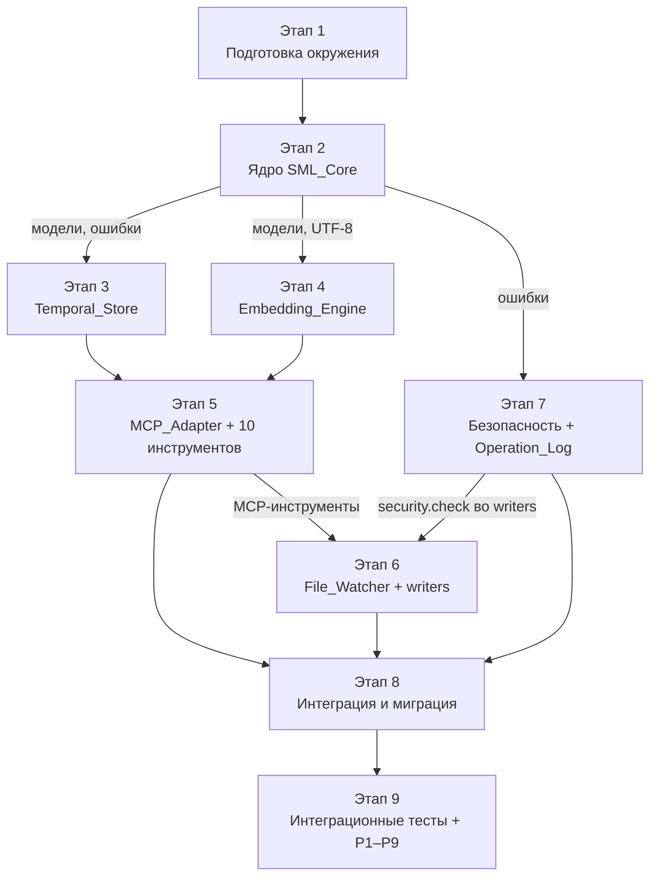

# План задач для слоя общей памяти агентов

## Как это читать

Этот документ — исполняемая декомпозиция дизайна из `design.md` и требований из `requirements.md` в задачи инкрементальной реализации Shared_Memory_Layer (SML) на Windows 11 + PowerShell 7. Задачи выполняются строго по порядку этапов: каждый следующий этап опирается на артефакты предыдущего, и только на уровне одного этапа подзадачи могут идти параллельно. Каждая задача имеет заголовок вида `N.M Название [Req X.Y; Pk]`, где `Req X.Y` — ссылка на конкретный пункт Acceptance Criteria требования, а `Pk` — номер correctness property из раздела 13 `design.md` (если применимо). Маркер `**Критично**` ставится на задачах, провал которых блокирует весь слой или нарушает ключевой нефункциональный лимит. В конце каждой задачи указан раздел «Готово, когда», задающий конкретную и проверяемую границу завершения.

Документ состоит из двух частей. В первой — подготовка окружения, ядро `SML_Core`, `Temporal_Store`, `Embedding_Engine`. Во второй — `MCP_Adapter` с 10 инструментами, `File_Watcher` с writers, безопасность и `Operation_Log`, интеграция с агентами и миграция.

## Задачи

- [x] 1. Этап 1. Подготовка окружения

  - [x] 1.1 Создать локальный venv `.venv-sml` через `pwsh` [Req 14.4]
    - Выполнить `python -m venv D:\AionUi-Paperclip\.venv-sml` из `C:\Program Files\PowerShell\7\pwsh.exe` с `-NoProfile`.
    - Убедиться, что активация venv работает через `D:\AionUi-Paperclip\.venv-sml\Scripts\Activate.ps1`.
    - Зафиксировать полный путь к интерпретатору `.venv-sml\Scripts\python.exe` в `docs/local-environment.md` (раздел SML).
    - Добавить `.venv-sml/` в `.gitignore`, если его там нет.
    - Готово, когда: команда `D:\AionUi-Paperclip\.venv-sml\Scripts\python.exe --version` печатает версию Python ≥ 3.11, а `pwsh -NoProfile -Command ".\.venv-sml\Scripts\Activate.ps1; python --version"` отрабатывает без ошибок.

  - [x] 1.2 **Критично** Установить Ollama через native Windows installer [Req 5.5, Req 9.4, Req 10.4, Req 14.4]
    - Скачать официальный установщик с `https://ollama.com/download/OllamaSetup.exe`.
    - Выполнить установку в пользовательском режиме без Docker и без JVM.
    - Это **ручной шаг оператора**: код-агент не запускает `.exe`, а выводит пользователю точные инструкции и ждёт подтверждения.
    - Убедиться, что локальная служба Ollama стартует и слушает только `127.0.0.1:11434` (проверка `Test-NetConnection 127.0.0.1 -Port 11434` через `pwsh`).
    - Выставить переменную окружения `OLLAMA_HOST=127.0.0.1` на уровне текущего пользователя через `setx OLLAMA_HOST 127.0.0.1`.
    - Готово, когда: команда `ollama --version` печатает версию, `curl http://127.0.0.1:11434/api/version` (или `Invoke-WebRequest`) возвращает 200, а внешний адрес порта 11434 недоступен.

  - [x] 1.3 Загрузить модель `bge-m3` через `ollama pull bge-m3` [Req 5.5, Req 9.4]
    - Выполнить `ollama pull bge-m3` в `pwsh`.
    - Дождаться полной загрузки модели (ожидаемый объём ~1.2 ГБ).
    - Проверить выдачу эмбеддинга через `ollama run bge-m3 "тест"` или `Invoke-RestMethod -Uri http://127.0.0.1:11434/api/embeddings -Method POST -Body '{"model":"bge-m3","prompt":"тест"}' -ContentType 'application/json; charset=utf-8'`.
    - Зафиксировать имя и размер модели (1024 dim) в `docs/local-environment.md`.
    - Готово, когда: `ollama list` показывает `bge-m3`, а запрос эмбеддинга возвращает массив из 1024 чисел float без ошибок UTF-8.

  - [x] 1.4 Создать каталоги проекта для SML [Req 14.4]
    - Создать `tools/sml/`, `tools/sml/writers/`, `var/sml/`, `var/sml/lance/`, `logs/` (если отсутствует).
    - Проверить, что существующие `tools/aion_memory_mcp.py` и `tools/watch-memory.ps1` не затронуты.
    - Добавить `var/sml/` и `logs/sml-*.ndjson` в `.gitignore`.
    - Готово, когда: все четыре каталога существуют, `git status` не показывает новых файлов под `var/sml/` и `logs/`, а прежние файлы `tools/` не изменены.

  - [x] 1.5 Установить зависимости pip в `.venv-sml` [Req 1.1, Req 1.5, Req 5.5]
    - Активировать `.venv-sml` и выполнить `python -m pip install --upgrade pip`.
    - Создать `tools/sml/requirements.txt` с пинами: `mcp`, `lancedb`, `sqlite-utils`, `watchdog`, `requests`, `pydantic>=2`.
    - Создать `tools/sml/requirements-dev.txt` с `pytest`, `hypothesis`.
    - Выполнить `pip install -r tools/sml/requirements.txt -r tools/sml/requirements-dev.txt`.
    - Зафиксировать версии через `pip freeze > tools/sml/requirements.lock`.
    - Готово, когда: установка завершается без ошибок, а `pip list` содержит все шесть рантайм-пакетов и `pytest`, `hypothesis`.

  - [x] 1.6 Создать `tools/sml/start-sml.ps1` — wrapper запуска SML [Req 1.5, Req 9.1, Req 10.4, Req 14.4]
    - Скрипт выставляет `PYTHONUTF8=1`, `OLLAMA_HOST=127.0.0.1`, `PYTHONPATH=D:\AionUi-Paperclip`.
    - Активирует `.venv-sml` неявно через прямой вызов `D:\AionUi-Paperclip\.venv-sml\Scripts\python.exe -X utf8 -m tools.sml.mcp_adapter`.
    - Пробрасывает `stdin`/`stdout`/`stderr` без буферизации (`PYTHONUNBUFFERED=1`).
    - Все параметры запуска вынесены в начало файла как PowerShell-переменные, чтобы было удобно править.
    - Готово, когда: `pwsh -NoProfile -File D:\AionUi-Paperclip\tools\sml\start-sml.ps1 --selfcheck` печатает на stdout строку `sml-selfcheck-ok` и возвращает exit code 0 (параметр `--selfcheck` будет реализован в задаче 2.1; на этом шаге достаточно, чтобы скрипт корректно передал аргумент и не упал на отсутствии модуля).

  - [x] 1.7 Smoke-проверка окружения [Req 1.1, Req 5.5, Req 9.4, Req 14.4]
    - Выполнить `D:\AionUi-Paperclip\.venv-sml\Scripts\python.exe -c "import mcp, lancedb, sqlite_utils, watchdog, requests, pydantic, hypothesis; print('ok')"`.
    - Выполнить `ollama run bge-m3 "проверка русского языка"` и убедиться, что ответ не содержит mojibake.
    - Выполнить `python -c "import sqlite3; print(sqlite3.sqlite_version)"` — версия SQLite ≥ 3.37 (для WAL и `RETURNING`).
    - Зафиксировать результаты в `docs/agent-log/` как отчёт по задаче 1.7.
    - Готово, когда: все три команды печатают ожидаемый вывод без ошибок, и отчёт добавлен в `docs/agent-log/`.

- [x] 2. Этап 2. Ядро SML_Core

  - [x] 2.1 Каркас пакета `tools/sml/` [Req 1.1, Req 4.1]
    - Создать `tools/sml/__init__.py` с версией пакета `__version__ = "0.1.0"`.
    - Создать пустые модули `core.py`, `models.py`, `validation.py`, `errors.py`, `ids.py`, `timefmt.py`, `response.py`.
    - Реализовать в `core.py` минимальный CLI-флаг `--selfcheck`, который печатает `sml-selfcheck-ok` и выходит с кодом 0.
    - Настроить пакет так, чтобы `python -m tools.sml.core --selfcheck` работал из корня проекта.
    - Готово, когда: `pwsh -NoProfile -File .\tools\sml\start-sml.ps1 --selfcheck` печатает `sml-selfcheck-ok` и возвращает exit 0.

  - [x] 2.2 Модель `Memory_Record` в `models.py` через pydantic v2 [Req 4.1, Req 4.2, Req 5.3, Req 6.1, Req 8.4, Req 9.1]
    - Определить класс `MemoryRecord(BaseModel)` со всеми 14 полями из `design.md` §5.1: `id`, `type`, `content`, `author_agent`, `created_at`, `updated_at`, `is_current`, `supersedes_id`, `superseded_by_id`, `source_file`, `source_lines`, `tags`, `embedding_vector` (как `list[float] | None`, не сериализуется в SQLite), `relevance_score_last`.
    - Настроить `model_config = ConfigDict(extra="forbid", str_strip_whitespace=False)` — пробелы в `content` не обрезаются, чтобы соблюсти побайтовое равенство [Req 9.1].
    - Задать границы через `Field(min_length=…, max_length=…)`: `content` 1–10000, `author_agent` 1–128, `tags` items 1–64, `tags` maxItems=20, `uniqueItems=True`.
    - Добавить computed-поле `as_public_dict()` для MCP-ответа без `embedding_vector`.
    - Готово, когда: `MemoryRecord.model_validate({...})` корректно валидирует пример из `design.md` §6.1, а попытка передать `content=""` или `content=" "*5` выбрасывает `ValidationError`.

  - [x] 2.3 Валидация 8 типов `Memory_Record` в `validation.py` [Req 4.1, Req 4.3]
    - Определить `Literal` или `StrEnum` `MemoryType` ровно с восемью значениями из `design.md` §5.2: `fact`, `preference`, `decision`, `agent_log`, `task`, `task_link`, `constraint`, `timeline_event`.
    - Реализовать функцию `validate_type(raw: str) -> MemoryType`, возвращающую нормализованное значение или выбрасывающую `UnsupportedError`.
    - Реализовать `validate_source_lines(value: str | None)` — формат `^[0-9]+-[0-9]+$`, `start ≤ end`, оба положительны.
    - Реализовать `validate_tags(value: list[str] | None)` — без дубликатов, 0–20 элементов, каждый 1–64 UTF-8.
    - Готово, когда: для каждого из восьми валидных значений `validate_type` возвращает корректный enum, а для `"foo"`, `""`, `"Fact "` (с пробелом) выбрасывается `UnsupportedError`.

  - [x] 2.4 Генератор идентификаторов UUIDv7 в `ids.py` [Req 4.2, Req 10.1]
    - Реализовать `new_id() -> str`, возвращающий каноническую строку UUID длиной 36 символов в нижнем регистре.
    - Старшие 48 бит UUIDv7 — миллисекунды UTC Unix time, остальное — случайные биты (использовать `secrets.token_bytes`).
    - Гарантировать монотонность id в пределах одного процесса: если два id сгенерированы в одну миллисекунду, счётчик младших бит должен обеспечивать лексикографический порядок.
    - Реализовать `validate_id(value: str) -> None` — строгая проверка длины 36, паттерн `^[0-9a-fA-F-]{36}$`, вариант и версия UUID v7.
    - Готово, когда: 10 000 последовательных вызовов `new_id()` возвращают строго возрастающую последовательность лексикографически, и `validate_id` отклоняет пустую строку, строку длиной 35, и строку с недопустимым символом.

  - [x] 2.5 Типизированные ошибки SML в `errors.py` [Req 2.5, Req 3.5, Req 4.3, Req 6.3, Req 9.3, Req 10.2, Req 11.4]
    - Определить базовый `SMLError(Exception)` с атрибутами `category: str`, `message: str` (на русском), `operation_id: str | None`.
    - Определить наследников: `ValidationError`, `NotFoundError`, `ConflictError`, `SecretRejectedError`, `IOErrorSML`, `TimeoutErrorSML`, `UnsupportedError`.
    - У каждого класса фиксированное значение `category` из множества `{"validation", "not_found", "conflict", "secret_rejected", "io_error", "timeout", "unsupported"}`.
    - Добавить фабрики с русскоязычными сообщениями по умолчанию: `ValidationError.for_field("content", "пустое значение")`, `NotFoundError.for_id(uuid)`, и т.п.
    - Готово, когда: `str(ValidationError("пустое значение"))` содержит русский текст без mojibake, а `SMLError` отлавливается `except SMLError:` во всех наследниках.

  - [x] 2.6 Unified response format в `response.py` [Req 2.5, Req 5.4, Req 9.3]
    - Реализовать `ok_response(payload: dict) -> dict` — возвращает `{"ok": True, **payload}`.
    - Реализовать `error_response(err: SMLError, operation_id: str) -> dict` — возвращает `{"ok": False, "error": {"category": err.category, "message": err.message, "operation_id": operation_id}}`.
    - Гарантировать, что `message` не содержит экранированных `\uXXXX`-последовательностей: JSON-сериализация использует `ensure_ascii=False`.
    - Добавить `format_score(value: float) -> float` — округление до 3 знаков после запятой в `[0.0, 1.0]`.
    - Готово, когда: `json.dumps(error_response(...), ensure_ascii=False)` содержит исходные кириллические символы, а `format_score(0.812345)` возвращает `0.812`.

  - [x] 2.7 Таймзоны ISO 8601 UTC с миллисекундами в `timefmt.py` [Req 6.1]
    - Реализовать `now_utc_ms() -> str` в формате `YYYY-MM-DDTHH:MM:SS.sssZ`.
    - Реализовать `parse_iso8601_ms(value: str) -> datetime` со строгой проверкой формата и часового пояса `Z` (UTC).
    - Реализовать `format_iso8601_ms(dt: datetime) -> str` — с точностью до миллисекунд, без наносекунд.
    - Отклонять значения без `Z`, с offset вида `+00:00`, с микросекундами длиннее 3 знаков.
    - Готово, когда: `format_iso8601_ms(parse_iso8601_ms("2026-05-11T11:09:12.345Z")) == "2026-05-11T11:09:12.345Z"` и `parse_iso8601_ms("2026-05-11T11:09:12Z")` бросает `ValidationError`.

  - [x]* 2.8 Property-тесты для модели и формата времени [Req 4.6, Req 9.1, Req 9.2]
    - **Property 3: Monotonicity of id** — для любой последовательности вызовов `new_id()` в одном процессе сохраняется строгий лексикографический порядок (Hypothesis: генерировать n от 2 до 200, собирать список id, утверждать `sorted(xs) == xs`).
    - **Property 9: UTF-8 Fidelity** — для произвольной unicode-строки `s` выполнено `MemoryRecord.model_validate({..., "content": s}).content == s` побайтово, без экранирования и транслитерации (Hypothesis: `st.text(min_size=1, max_size=10000)`, отфильтровать пробельные-только).
    - **Validates: Requirements 4.6 (монотонность), 9.1, 9.2 (UTF-8 fidelity).**
    - Тесты располагаются в `tools/sml/tests/test_models_properties.py`.
    - Готово, когда: `pytest tools/sml/tests/test_models_properties.py -q` проходит без падений Hypothesis (минимум 100 примеров на свойство).

- [x] 3. Этап 3. Temporal_Store (SQLite WAL)

  - [x] 3.1 Схема БД и открытие в `tools/sml/temporal_store.py` [Req 3.1, Req 3.3, Req 6.1, Req 6.2, Req 8.3]
    - Реализовать `open_store(path: Path) -> TemporalStore` — открывает `var/sml/state.db` c `journal_mode=WAL`, `synchronous=NORMAL`, `foreign_keys=ON`.
    - Создать таблицу `records` со столбцами: `id TEXT PRIMARY KEY`, `type TEXT NOT NULL`, `content TEXT NOT NULL`, `author_agent TEXT NOT NULL`, `created_at TEXT NOT NULL`, `updated_at TEXT NOT NULL`, `is_current INTEGER NOT NULL`, `supersedes_id TEXT`, `superseded_by_id TEXT`, `source_file TEXT`, `source_lines TEXT`, `tags TEXT` (JSON-encoded массив), `content_hash TEXT NOT NULL`.
    - Создать таблицу `records_history(id TEXT, valid_from TEXT, valid_to TEXT, is_current INTEGER, snapshot TEXT)` для реконструкции «как было тогда».
    - Создать таблицу `sync_state(source_file TEXT PRIMARY KEY, last_hash TEXT, last_indexed_at TEXT)` для File_Watcher.
    - Готово, когда: свежая БД открывается без ошибок, `PRAGMA journal_mode` возвращает `wal`, а `sqlite_master` содержит все три таблицы.

  - [x] 3.2 Индексы из design §8.1 [Req 6.6, Req 7.2, Req 8.2, Req 11.1, Req 11.3]
    - `CREATE UNIQUE INDEX idx_records_id ON records(id)`.
    - `CREATE INDEX idx_records_current ON records(is_current, updated_at DESC)`.
    - `CREATE INDEX idx_records_type_updated ON records(type, updated_at DESC)`.
    - `CREATE INDEX idx_records_supersedes ON records(supersedes_id)`.
    - `CREATE INDEX idx_records_source_file ON records(source_file)`.
    - Все индексы создавать в функции `migrate(store)` и только при отсутствии (`IF NOT EXISTS`).
    - Готово, когда: `EXPLAIN QUERY PLAN SELECT * FROM records WHERE is_current=1 ORDER BY updated_at DESC LIMIT 20` показывает использование `idx_records_current`.

  - [x] 3.3 CRUD-операции `TemporalStore` [Req 2.1, Req 2.4, Req 2.6, Req 3.1, Req 4.2]
    - `insert(record: MemoryRecord) -> None` — `INSERT` с параметризованным запросом; дубликат `id` → `ConflictError`.
    - `read_by_id(id: str) -> MemoryRecord | None` — `SELECT` по первичному ключу, десериализация JSON-полей.
    - `update_fields(id: str, **fields) -> MemoryRecord` — пишет старую версию в `records_history`, обновляет `updated_at` автоматически, перехватывает `id not found` → `NotFoundError`.
    - `delete(id: str) -> None` — мягкое удаление через запись `deleted_at` в `records_history` (финальное удаление из `records` запрещено [Req 4.6]).
    - Все CRUD-операции используют параметризованные запросы; конкатенация SQL запрещена.
    - Готово, когда: `insert` + `read_by_id` возвращают побайтово идентичный `content`, повторный `insert` того же `id` бросает `ConflictError`, а `read_by_id("<несуществующий>")` возвращает `None`.

  - [x] 3.4 Атомарное суперседирование в одной транзакции [Req 6.2, Req 6.3]
    - Реализовать `supersede(new_id: str, old_ids: list[str]) -> list[str]`.
    - Внутри `BEGIN IMMEDIATE ... COMMIT`:
      - проверить существование `new_id` и всех `old_ids` (при отсутствии любого → `NotFoundError`, ROLLBACK);
      - проверить, что ни у одного `old_id` ещё нет `superseded_by_id` (иначе → `ConflictError`, ROLLBACK);
      - у всех `old_ids` выставить `is_current=0`, `superseded_by_id=new_id`, обновить `updated_at`;
      - у `new_id` выставить `is_current=1` (должно быть уже так после `insert`);
      - для каждого изменения записать строку в `records_history`.
    - При любой ошибке — откатить транзакцию целиком, ни одно поле не должно измениться.
    - Готово, когда: unit-тест с двумя `old_ids`, один из которых уже суперседирован, оставляет оба записи в исходном состоянии после `ConflictError` (проверка через `read_by_id`).

  - [x] 3.5 Temporal_Query — state-at-time через `records_history` [Req 6.4, Req 6.5]
    - Реализовать `query_at(at: str, type_filter: str | None, only_current_at: bool, limit: int) -> list[MemoryRecord]`.
    - Запрос собирает состояние: `SELECT snapshot FROM records_history WHERE valid_from <= :at AND (valid_to IS NULL OR valid_to > :at)`, затем по желанию фильтр по типу и `is_current` на момент `at`.
    - Отклонять `at` в будущем относительно `now_utc_ms()` → `ValidationError`.
    - Отклонять `at` раньше `MIN(created_at)` по всей БД → `ValidationError`.
    - Готово, когда: сценарий «создать запись A, суперседировать запись B, запросить `at = момент_до_супер`» возвращает обе записи с `is_current=true`, а `at` в будущем отклоняется как `validation`.

  - [x] 3.6 Fsync-контракт durability [Req 3.1, Req 3.4, Req 3.5]
    - В `insert`, `update_fields`, `supersede` после успешного COMMIT вызвать `PRAGMA wal_checkpoint(PASSIVE)` не чаще раза в 2 секунды (чтобы не замедлять горячий путь).
    - Использовать `synchronous=NORMAL` в связке с WAL (надёжно при Typical_Volume и при этом укладывается в бюджет 5 с [Req 3.1]).
    - При любой ошибке IO на уровне диска пробрасывать `IOErrorSML("io_error", "Сбой записи на диск")` без частичных изменений.
    - Реализовать `close()` с финальным `wal_checkpoint(TRUNCATE)`.
    - Готово, когда: интеграционный тест «insert N записей → kill процесса → переоткрыть БД → прочитать все N через `read_by_id`» проходит на N=100.

  - [x] 3.7 Миграции схемы — нумерованные schema_versions [Req 3.3, Req 14.4]
    - Создать таблицу `schema_migrations(version INTEGER PRIMARY KEY, applied_at TEXT NOT NULL)`.
    - Первая миграция `001_initial.sql` создаёт `records`, `records_history`, `sync_state` и все индексы из 3.2.
    - Функция `migrate(store)` читает текущую версию, применяет недостающие миграции строго по возрастанию номера, в одной транзакции на миграцию.
    - При отсутствии таблицы `schema_migrations` считать версию = 0.
    - Готово, когда: повторный запуск `migrate` на уже мигрированной БД завершается мгновенно и не меняет содержимое; удаление таблицы `schema_migrations` и повторный `migrate` восстанавливают схему без потери данных, если данные уже соответствуют схеме.

  - [x]* 3.8 Unit- и property-тесты `Temporal_Store` [Req 3.1, Req 3.4, Req 6.2]
    - Unit-тесты CRUD: `test_insert_read_roundtrip`, `test_duplicate_id_conflict`, `test_delete_soft`, `test_update_writes_history`.
    - **Property 1: Durability** — для произвольного набора n записей (Hypothesis: n от 1 до 50), после `insert(record)` и `close()` с повторным `open_store()` каждая запись читается `read_by_id` побайтово.
    - **Property 5: Supersede Atomicity** — для произвольных пар (new_id, старая_запись), при любом искусственном сбое в середине `supersede` (mock исключения в транзакции) состояние БД остаётся в исходном виде: `is_current` и `superseded_by_id` не меняются ни у одной записи.
    - **Validates: Requirements 3.1, 3.4 (durability), 6.2 (supersede atomicity).**
    - Тесты в `tools/sml/tests/test_temporal_store.py` и `test_temporal_store_properties.py`.
    - Готово, когда: `pytest tools/sml/tests/test_temporal_store*.py -q` проходит целиком, Hypothesis выполняет ≥ 100 примеров на каждое свойство.

  - [x] 3.9 **Критично** Бенчмарк `sml.read` на 10 000 записей ≤ 200 мс [Req 11.3]
    - Скрипт `tools/sml/bench/bench_read.py`: подготовить 10 000 синтетических записей (русскоязычное `content`, разные типы) через прямой `insert`.
    - Выполнить 1000 случайных `read_by_id` и измерить p50, p95, p99 в миллисекундах.
    - Результаты сохранить в `logs/bench/bench-read-<ts>.txt`.
    - При p99 > 200 мс — провалить задачу и проанализировать план запроса через `EXPLAIN QUERY PLAN`.
    - Готово, когда: на локальной машине Windows 11 + SSD измерения показывают p99 ≤ 200 мс, результат зафиксирован в `docs/agent-log/`.

- [x] 4. Этап 4. Embedding_Engine

  - [x] 4.1 Клиент Ollama в `tools/sml/embedding_engine.py` [Req 5.5, Req 9.4, Req 10.4]
    - Реализовать `OllamaEmbedder` c методом `embed_text(text: str) -> list[float]`.
    - POST на `http://127.0.0.1:11434/api/embeddings` через `requests`, модель `bge-m3`, таймаут 3 с на один запрос.
    - Явно задавать `headers={"Content-Type": "application/json; charset=utf-8"}` и `json=dict` (без ручного `json.dumps`), чтобы requests сам обеспечил UTF-8.
    - Проверять, что длина ответа ровно 1024; иначе — `IOErrorSML`.
    - Никаких обращений за пределы `127.0.0.1`; при попытке изменить hostname — падать на старте.
    - Готово, когда: `embed_text("тестовая строка на русском")` возвращает список из 1024 float, и повторный вызов на той же строке возвращает идентичный вектор (детерминизм bge-m3).

  - [x] 4.2 Открытие LanceDB и схема таблицы `embeddings` [Req 5.3, Req 5.5, Req 11.1]
    - Реализовать `open_lance(path: Path) -> EmbeddingStore`.
    - Создать таблицу `embeddings` с полями: `id: str` (совпадает с `records.id`), `vector: fixed_size_list<float32, 1024>`.
    - Реализовать `upsert(id: str, vector: list[float]) -> None` и `delete(id: str)`.
    - Физический путь — `var/sml/lance/embeddings.lance`.
    - Готово, когда: открытие уже существующей таблицы не перезатирает данные, `upsert` идемпотентен при повторе с тем же `id` и `vector`.

  - [x] 4.3 ANN-индекс `IVF_HNSW` [Req 5.3, Req 11.1]
    - Создавать индекс `IVF_HNSW` c `num_partitions=64`, `M=16` при достижении 1000 записей (до этого ANN не нужен, brute-force укладывается в бюджет).
    - Параметры вынести в константы `LANCE_NUM_PARTITIONS`, `LANCE_HNSW_M` в `embedding_engine.py`.
    - Реализовать `ensure_index(store)` — идемпотентно: пересоздавать индекс, только если число записей выросло более чем в 2 раза с момента последнего build.
    - Готово, когда: при 1500 тестовых записях `ensure_index` создаёт индекс без ошибок и последующий `search` использует его (замер времени < 50 мс на запрос).

  - [x] 4.4 Semantic_Query — косинус + нормировка + порог 0.5 [Req 5.3, Req 5.4, Req 5.6]
    - Реализовать `semantic_query(query: str, limit: int, include_superseded: bool, type_filter: list[str] | None) -> list[tuple[MemoryRecord, float]]`.
    - Шаги: `embed_text(query)` → `lance.search(vector).limit(max(limit, 50))` с метрикой cosine.
    - Преобразовать сырой cos → `(1 + cos) / 2`, округлить до 3 знаков через `format_score`.
    - Отбросить результаты со score < 0.5.
    - Отсортировать по убыванию score, обрезать до `limit` (1–50).
    - Готово, когда: при пустой базе возвращается `[]`; при одной записи со 100% совпадением текста — score ≥ 0.999; при несвязном запросе и одной релевантной записи — релевантная в топ-1.

  - [x] 4.5 JOIN с Temporal_Store по id и фильтр `is_current` [Req 5.3, Req 6.6, Req 6.7]
    - После `lance.search` получить список кандидатов `(id, score)`.
    - Батчевым `SELECT ... WHERE id IN (:ids)` подтянуть `MemoryRecord` из `records`.
    - По умолчанию отбросить записи с `is_current = 0` [Req 6.6].
    - Если `include_superseded = true`, оставить неактуальные и добавить `superseded_by_id` в ответ [Req 6.7].
    - Применить `type_filter` по типу, если задан.
    - Готово, когда: для сценария «актуальная + неактуальная с одинаковым content»: при `include_superseded=false` возвращается только актуальная, при `include_superseded=true` — обе, причём у неактуальной заполнен `superseded_by_id`.

  - [x] 4.6 Валидация и формат ответа `semantic_query` [Req 5.1, Req 5.2, Req 5.4, Req 9.3]
    - Отклонять пустой запрос, только-пробельный и длиннее 1000 символов → `ValidationError` с русским сообщением.
    - Отклонять `limit` вне `[1, 50]` → `ValidationError`.
    - Формат результата: список объектов `{"record": {...}, "relevance_score": 0.812}`, отсортированный по убыванию `relevance_score`.
    - При Typical_Volume > 10 000 — устанавливать `degraded=true` в ответе; целостность не нарушается [Req 11.5].
    - Готово, когда: unit-тесты на `query=""`, `query="   "`, `query=` строка 1001 символ, и `limit=0`, `limit=51` возвращают ошибки с `category="validation"`.

  - [x]* 4.7 Unit-тесты русских синонимов + property-тесты детерминизма [Req 5.5, Req 5.6]
    - Unit-тест: записать в базу 20 `Memory_Record` на русском, выполнить 5 запросов-синонимов («локальная MCP-память» ↔ «встроенная память для агентов») и убедиться, что целевая запись попадает в топ-10 (recall@10 ≥ 0.8 на отобранной микровыборке).
    - **Property 8: Semantic Query Determinism** — для фиксированной базы и фиксированного запроса `q`, два последовательных вызова `semantic_query(q)` возвращают идентичный упорядоченный список `(id, relevance_score)`.
    - **Validates: Requirements 5.5 (синонимы), 5.6 (порог 0.5), 5.3 (детерминированный порядок).**
    - Тесты в `tools/sml/tests/test_embedding_engine.py` и `test_embedding_properties.py`.
    - Готово, когда: оба файла тестов проходят, Hypothesis для P8 выполняет ≥ 50 примеров без падений.

  - [x] 4.8 **Критично** Бенчмарк `semantic_query` ≤ 500 мс на Typical_Volume [Req 11.1]
    - Скрипт `tools/sml/bench/bench_semantic.py`: подготовить 10 000 `Memory_Record` с реальными эмбеддингами через bge-m3 (кеш векторов на диск, чтобы повтор не дёргал Ollama).
    - Выполнить 200 семантических запросов с `limit=20` на заранее подготовленном списке русских фраз.
    - Измерить p50, p95, p99 end-to-end (от вызова `semantic_query` до возврата).
    - Разложить бюджет: embedding, ANN, JOIN, сериализация — отдельные счётчики.
    - Готово, когда: p99 ≤ 500 мс на локальной машине, результат записан в `logs/bench/bench-semantic-<ts>.txt` и упомянут в `docs/agent-log/`.

- [x] 5. Этап 5. MCP_Adapter и 10 инструментов

  - [x] 5.1 **Критично** Каркас `MCP_Adapter` в `tools/sml/mcp_adapter.py` [Req 1.1, Req 1.2, Req 1.4, Req 1.5, Req 1.6]
    - Реализовать цикл чтения newline-stdio: один JSON-объект на строку, UTF-8, `ensure_ascii=False` на выходе.
    - Диспетчер: словарь `{"sml.ping": handle_ping, "sml.read": handle_read, ...}` с регистрацией всех 10 инструментов.
    - Корреляция: передавать входной `id` запроса в поле `id` ответа без изменений.
    - Обёртка вокруг каждого обработчика: ловит `SMLError` и форматирует через `error_response`, ловит `Exception` и формирует `category="io_error"` с `operation_id`.
    - Генерировать `operation_id` вида `<timestamp>-sml-<счётчик>` и класть его в Operation_Log.
    - Флаг `--selfcheck` реализовать реально: печатает `sml-selfcheck-ok`, проверяет, что Temporal_Store открывается и Ollama отвечает на `/api/version`.
    - Готово, когда: ручной тест — передать в stdin JSON `{"jsonrpc":"2.0","id":7,"method":"sml.ping","params":{}}`, получить строку с `"id":7` и `"ok":true`.

  - [x] 5.2 `sml.write` — добавление Memory_Record [Req 4.2, Req 4.3, Req 3.1, Req 6.2, Req 10.2]
    - JSON-схема входа/выхода — по `design.md` §6.1.
    - Шаги: валидация полей → проверка секретов через `security.check` → `TemporalStore.insert` → расчёт эмбеддинга и `EmbeddingStore.upsert` → при `supersedes_id` вызвать `TemporalStore.supersede(new_id, [supersedes_id])`.
    - `Operation_Log`: `op="write"`, `record_id=new.id`, `result` из `{success, rejected, error}` с `reason_category`.
    - Возможные ошибки: `validation`, `unsupported`, `not_found`, `secret_rejected`, `io_error`, `conflict`.
    - Готово, когда: интеграционный тест создаёт запись, `sml.read` возвращает побайтово идентичный `content` и корректные метки времени, `is_current=true`.

  - [x] 5.3 `sml.read` — чтение по id [Req 2.6, Req 11.3]
    - JSON-схема по `design.md` §6.2.
    - Валидация `id` (UUIDv7, 36 символов). При отсутствии — `{"ok": true, "found": false}`.
    - `Operation_Log`: `op="read"`, `record_id=id`.
    - Готово, когда: p95 ≤ 200 мс на базе 10 000 записей (повтор бенчмарка из 3.9).

  - [x] 5.4 `sml.semantic_query` — семантический поиск [Req 5.1–5.6, Req 11.1; P8]
    - JSON-схема по `design.md` §6.3.
    - Делегировать в `EmbeddingEngine.semantic_query(query, limit, include_superseded, type_filter)`.
    - Ошибки: `validation` для пустого/пробельного/>1000 символов, `timeout` при превышении лимита.
    - В ответе — флаг `degraded=true`, если `records_total > 10 000`.
    - `Operation_Log`: `op="semantic_query"`, `record_id=null`.
    - Готово, когда: все примеры из §6.3 возвращают корректные ответы, p95 ≤ 500 мс на 10 000 записей.

  - [x] 5.5 `sml.temporal_query` — состояние на метку времени [Req 6.4, Req 6.5]
    - JSON-схема по `design.md` §6.4.
    - Делегировать в `TemporalStore.query_at(at, filter, limit)`.
    - Ошибки: `validation` для `at` в будущем или раньше `MIN(created_at)`.
    - Готово, когда: сценарий из задачи 3.5 (A актуально до `t`, B суперседировано после `t`) возвращает корректные состояния для обеих меток времени.

  - [x] 5.6 `sml.supersede` — атомарное суперседирование [Req 6.2, Req 6.3; P5]
    - JSON-схема по `design.md` §6.5.
    - Валидация: `new_id` существует, все `old_ids` существуют, никто не имеет `superseded_by_id`.
    - Делегировать в `TemporalStore.supersede`; при любой ошибке — полный откат транзакции.
    - `Operation_Log`: `op="supersede"`, `record_id=new_id`.
    - Готово, когда: unit-тест с конфликтом на среднем элементе `old_ids` не меняет ни одной записи (все поля равны pre-значениям).

  - [x] 5.7 `sml.add_decision` — запись решения + append в `docs/decisions.md` [Req 13.3, Req 8.5, Req 13.5]
    - JSON-схема по `design.md` §6.6.
    - Шаги: валидация → рендер Markdown-блока (`## <дата> - <title>`, «Контекст», «Решение», «Автор») → atomic append через temp + `os.replace` → создание `Memory_Record` типа `decision` с `source_file="docs/decisions.md"` и `source_lines` на новый блок.
    - При ошибке IO файл остаётся в прежнем состоянии, запись не создаётся.
    - `Operation_Log`: `op="add_decision"`, `record_id=new.id`.
    - Готово, когда: существующие разделы файла не затираются, а последующий `sml.build_context_pack` включает новое решение.

  - [x] 5.8 `sml.add_log` — запись журнала + файл в `docs/agent-log/` [Req 13.2, Req 8.5, Req 13.5]
    - JSON-схема по `design.md` §6.7.
    - Шаги: валидация → рендер по `docs/templates/agent-report.md` → atomic write файла `docs/agent-log/YYYY-MM-DD-HHMM-<agent>-<slug>.md` через temp + `os.replace` → `Memory_Record` типа `agent_log` с `source_lines=1-<EOF>`.
    - `slug` — первые 6 слов из `request`, пробелы → `-`, транслитерации нет.
    - `Operation_Log`: `op="add_log"`, `record_id=new.id`.
    - Готово, когда: файл содержит кириллицу без mojibake, а повторный вызов с тем же `slug` создаёт отдельный файл с другой временной меткой.

  - [x] 5.9 `sml.build_context_pack` — пересборка context-pack [Req 13.4, Req 14.2]
    - JSON-схема по `design.md` §6.8.
    - Шаги: `build_sections()` (6 разделов в Markdown с заголовками `---` и `## Файл: ...`, совместимо с `tools/watch-memory.ps1`) → atomic replace `docs/context-packs/context-pack-latest.md` через temp + `os.replace`.
    - Блокировка ≤ 5 с, до 3 повторов с паузой 250 мс, затем `conflict`.
    - `Operation_Log`: `op="build_context_pack"`.
    - Готово, когда: после вызова `sml.build_context_pack` запуск `tools/watch-memory.ps1` пересобирает файл без ошибок парсинга.

  - [x] 5.10 `sml.startup_pack` — стартовый контекстный пакет [Req 7.1–7.6, Req 11.2]
    - JSON-схема по `design.md` §6.9.
    - Шаги: для 6 разделов (`project_nature`, `decisions`, `active_tasks`, `preferences`, `constraints`, `recent_logs`) — типизированные запросы в `TemporalStore` с фильтром `type`/`tags`, лимитом по разделу, сортировкой `updated_at DESC`, фильтром «не старше 30 дней».
    - Пустой раздел → `[]` + имя в `empty_sections`, `complete=false`.
    - SLA 1 секунда на Typical_Volume.
    - Готово, когда: на пустой базе все 6 разделов — пустые массивы, `empty_sections` содержит 6 имён, `complete=false`.

  - [x] 5.11 `sml.ping` — проверка доступности [Req 12.4]
    - JSON-схема по `design.md` §6.10.
    - Читает из памяти процесса: `uptime_seconds`, `version`, `records_total` (cached), `degraded`.
    - SLA 2 секунды.
    - Готово, когда: p99 ≤ 10 мс даже при 50 000 записей.

  - [x]* 5.12 Property-тесты MCP-контракта [Req 1.5, Req 1.6, Req 2.5, Req 9.3]
    - **Correlation:** для произвольного N одновременных запросов с разными `id` (Hypothesis: N 1–50) ответы имеют те же `id` и ровно в количестве N.
    - **Schema conformance:** для любого валидного входа по JSON-схеме ответ валиден по выходной схеме (`jsonschema.validate`).
    - **Error taxonomy:** любой нарушающий инварианты вход → `ok=false` и `category` из 7 допустимых значений.
    - Готово, когда: `pytest tools/sml/tests/test_mcp_contract_properties.py -q` проходит, ≥ 100 примеров на свойство.

- [x] 6. Этап 6. File_Watcher и writers

  - [x] 6.1 `File_Watcher` на `watchdog` в `tools/sml/file_watcher.py` [Req 8.1, Req 8.2]
    - Настроить `Observer` и `FileSystemEventHandler` на каталоги: `AGENTS.md`, `docs/current-context.md`, `docs/tasks.md`, `docs/decisions.md`, `docs/agent-log/`, `docs/handoffs/`, `docs/memory/layers/`, `docs/context-packs/context-pack-latest.md`.
    - Debounce 500 мс: события по одному файлу сливаются в одно событие обновления.
    - Работать в отдельном потоке, чтобы не блокировать MCP-адаптер.
    - Готово, когда: ручной `notepad docs/current-context.md` + сохранение через 2 секунды вызывает один вызов обработчика watcher.

  - [x] 6.2 Короткие файловые блокировки и retry [Req 14.1, Req 14.3]
    - Утилита `with_file_lock(path, timeout=5, retries=3, delay=0.25)`.
    - Реализовать через `msvcrt.locking` на Windows или `portalocker` (приоритет `msvcrt` — без лишних зависимостей).
    - При исчерпании повторов — `ConflictError("conflict", "Не удалось получить блокировку файла <path>")`.
    - Готово, когда: unit-тест с искусственным удержанием блокировки 6 секунд корректно падает через `ConflictError`, а при удержании 300 мс — успешно получает доступ со второй попытки.

  - [x] 6.3 Алгоритм File → SML (sync) [Req 8.2, Req 8.3]
    - В `tools/sml/sync_from_file.py`: `sync_file(path) -> None`.
    - Шаги: прочитать файл → посчитать `content_hash` (sha256) → сравнить с `sync_state.last_hash` → при совпадении выйти, при различии:
      - определить тип `Memory_Record` по `mapping_file_to_type` (задача 6.8),
      - разбить содержимое на логические блоки (один блок — одна запись), правила разбиения из `design.md` §7.4,
      - для каждого блока выполнить upsert: `read_by_source_lines` → если записи нет, `insert`; если есть и `content_hash` различается, `update_fields` + запись в `records_history`,
      - обновить `sync_state.last_hash` и `last_indexed_at`.
    - SLA: ≤ 60 секунд от `on_modified` до видимости через `sml.read` [Req 8.2].
    - Готово, когда: изменение строки в `docs/memory/layers/facts.md` через 10 секунд становится видимым через `sml.semantic_query`.

  - [x] 6.4 Разрешение конфликта в пользу файла [Req 8.3, Req 8.7; P4]
    - Если блок в `records` не равен блоку в файле — файл истина, `Memory_Record` приводится к файлу.
    - `Operation_Log`: `op="sync_conflict_file_wins"`, `reason_category="file_wins"`.
    - Готово, когда: ручная правка `content` в SQLite через внешний инструмент, затем пересохранение файла возвращает `Memory_Record` к значению из файла в течение 60 секунд.

  - [x] 6.5 Writer `docs/decisions.md` (append atomic) [Req 13.3, Req 13.5]
    - В `tools/sml/writers/decisions.py`: `append_decision(title, context, decision, author_agent, tags) -> (source_lines: str)`.
    - Использовать блокировку из 6.2. Writer формирует блок, дописывает к файлу, `os.replace` через temp, возвращает `source_lines`.
    - Готово, когда: unit-тест вставки 5 решений подряд даёт монотонно растущие `source_lines` и ни разу не затирает предыдущие блоки.

  - [x] 6.6 Writer `docs/agent-log/*.md` [Req 13.2, Req 13.5]
    - В `tools/sml/writers/agent_log.py`: `create_log_file(date, author, request, plan, result, changed_files, risks, next_steps) -> Path`.
    - Шаблон — `docs/templates/agent-report.md`. Если шаблон отсутствует — упасть с `ValidationError("validation", "Шаблон docs/templates/agent-report.md не найден")`.
    - Имя файла: `YYYY-MM-DD-HHMM-<author>-<slug>.md`, `slug` из первых 6 слов `request`.
    - Готово, когда: создание 3 записей с разной датой/автором даёт 3 файла в правильном формате, все читаются `Get-Content` без mojibake.

  - [x] 6.7 Writer `docs/context-packs/context-pack-latest.md` [Req 13.4, Req 14.2]
    - В `tools/sml/writers/context_pack.py`: `build_and_write(sections: dict) -> None`.
    - Формат совпадает с текущим `context-pack-latest.md` (заголовок `# Контекстный пакет`, дата сборки, разделы `## Файл: ...`, разделитель `---`).
    - Запись через temp + `os.replace`, блокировка из 6.2.
    - Готово, когда: после записи `tools/watch-memory.ps1` запускается и пересобирает файл без отличий формата.

  - [x] 6.8 Маппинг «файл → тип Memory_Record» [Req 4.1, Req 8.5]
    - В `tools/sml/sync_from_file.py` — словарь `mapping_file_to_type`:
      - `docs/memory/layers/facts.md` → `fact`
      - `docs/memory/layers/preferences.md` → `preference`
      - `docs/memory/layers/constraints.md` → `constraint`
      - `docs/memory/layers/timeline.md` → `timeline_event`
      - `docs/decisions.md` → `decision`
      - `docs/tasks.md` → `task`
      - `docs/agent-log/*.md` → `agent_log`
      - `docs/current-context.md` → `fact` с тегом `current`
      - `docs/handoffs/*.md` → `agent_log` с тегом `handoff`
    - Правило разбиения на блоки по каждому типу — по `design.md` §7.4.
    - Готово, когда: unit-тест «проиндексировать типовые файлы из `docs/` и проверить количество созданных записей» соответствует ожидаемому (зафиксировано в тесте).

  - [x] 6.9 Интеграционный тест сосуществования с `tools/watch-memory.ps1` [Req 14.1, Req 14.3]
    - Запустить SML и `watch-memory.ps1` одновременно. Автоматически в течение 5 минут 30 раз модифицировать случайный файл в `docs/memory/layers/`.
    - Проверить, что `Operation_Log` не содержит `conflict` более 10% от числа попыток, а итоговый `docs/context-packs/context-pack-latest.md` корректен.
    - Готово, когда: тест зелёный 3 прогона подряд.

  - [x]* 6.10 Property-тест P4 File Authority [Req 8.1, Req 8.3, Req 8.7]
    - Для произвольного набора из N файлов из `docs/memory/layers/` (Hypothesis: N 1–5) и произвольных изменений их содержимого: после завершения `sync_from_file` для каждого файла и каждого блока выполняется `record.content == extract(source_file, source_lines)` с точностью до нормализации пробелов.
    - **Validates:** Requirements 8.1, 8.3, 8.7.
    - Готово, когда: `pytest tools/sml/tests/test_file_authority_property.py -q` проходит, ≥ 50 примеров Hypothesis.

- [x] 7. Этап 7. Безопасность и Operation_Log

  - [x] 7.1 `security.py` — Уровень 1: regex-паттерны секретов [Req 10.2; P6]
    - В `tools/sml/security.py` — список `KNOWN_SECRET_PATTERNS` с 15 regex из `design.md` §9.1: `sk-`, `sk-ant-`, `ghp_`, `gho_`, `ghs_`, `xox[baprs]-`, `AKIA…`, `aws_secret_access_key=…`, `AIza…`, `ya29.`, `JWT eyJ…`, PEM-ключи, `api_key=…`, `password=…`, `glpat-…`.
    - Функция `check_pattern(text: str) -> str | None` возвращает категорию `pattern_match` с именем паттерна или `None`.
    - Готово, когда: unit-тесты на каждый из 15 паттернов с реальным примером формата (без настоящих секретов) дают положительное срабатывание; на безопасном русском тексте — `None`.

  - [x] 7.2 `security.py` — Уровень 2: энтропия Шеннона [Req 10.2; P6]
    - Функция `check_entropy(text: str) -> str | None`.
    - Для каждой подстроки длиной 20–200 из класса `[A-Za-z0-9+/=_\-]` — энтропия Шеннона в бит/символ.
    - Порог: ≥ 4.5 бит/символ.
    - Словарный фильтр: если подстрока содержит ≥ 3 слов длиной ≥ 4 из словаря (русский + английский минимум), считать её НЕ секретом.
    - Готово, когда: unit-тест показывает, что случайная base64 строка длиной 40 срабатывает как `high_entropy`, а русское предложение из 40 букв — нет.

  - [x] 7.3 Интеграция детектора во все write-пути [Req 10.2; P6]
    - Встроить вызов `security.check(text)` в обработчики `sml.write`, `sml.add_decision`, `sml.add_log` перед любой записью в `TemporalStore`, LanceDB и файлы.
    - При срабатывании — `SecretRejectedError` с русским сообщением, запись `rejected` в `Operation_Log` с `reason_category`.
    - Гарантия: `content` секрета ни в одном виде не попадает ни в БД, ни в файлы, ни в Operation_Log (логируется только категория).
    - Готово, когда: интеграционный тест пытается записать `sk-abcdef…30символов…` через все три инструмента и во всех трёх случаях получает `category="secret_rejected"`, а последующий `sml.semantic_query` «sk-abcdef» возвращает пустой результат.

  - [x] 7.4 `operation_log.py` — JSONL append-only [Req 10.1, Req 10.3]
    - Путь: `logs/sml-operation-log.ndjson` относительно корня.
    - Формат одной записи — по `design.md` §9.2.
    - Открытие файла в append-binary режиме, `flush` + `os.fsync` после каждой записи.
    - Готово, когда: запись из `sml.ping` появляется в файле в течение 1 секунды, читается через `Get-Content` без запуска SML.

  - [x] 7.5 Ротация по календарным дням UTC + удержание 30 дней [Req 10.3]
    - При первой записи нового UTC-дня — переименовать текущий файл в `logs/sml-operation-log-YYYY-MM-DD.ndjson`, открыть новый `sml-operation-log.ndjson`.
    - Фоновая задача (`threading.Timer` или корутина, раз в сутки) удаляет файлы `sml-operation-log-*.ndjson` старше 30 дней.
    - Готово, когда: ручной тест с переводом системной даты создаёт новый файл ротации, а файлы старше 30 дней удаляются.

  - [x] 7.6 Loopback-only guard [Req 10.4; P7]
    - В `tools/sml/core.py` при старте: проверить `OLLAMA_HOST` — если не `127.0.0.1` или `::1`, упасть с русским сообщением и exit code 1.
    - Нет сокетов открытых SML (sanity check через `psutil.Process(pid).connections()` — не должно быть LISTEN).
    - Готово, когда: запуск с `OLLAMA_HOST=example.com` падает с понятным сообщением и не загружает БД.

  - [x] 7.7 Доступность Operation_Log во время работы SML [Req 10.3]
    - `operation_log.py` открывает файл с `buffering=0` или выполняет `flush` + `fsync` после каждой записи, чтобы `Get-Content -Tail` видел живые данные.
    - Готово, когда: `Get-Content -Tail 5 -Wait logs/sml-operation-log.ndjson` показывает новые строки по мере поступления.

  - [x]* 7.8 Property-тесты безопасности [Req 10.2, Req 10.4; P6, P7]
    - **P6 Secret Leak Prevention:** для произвольного входа с паттерном (Hypothesis стратегия генерирует строки по каждому из 15 паттернов) — запись отклонена, `Memory_Record` не создан, в файлах нет значения.
    - **P7 No Network Leak:** во время работы SML перечень исходящих TCP-соединений вне `127.0.0.1/8` и `::1/128` пуст (проверка через `psutil`).
    - Готово, когда: `pytest tools/sml/tests/test_security_properties.py -q` зелёный, ≥ 100 примеров на P6 и ≥ 10 итераций на P7.

- [x] 8. Этап 8. Интеграция с агентами и миграция

  - [x] 8.1 Обновить конфиги MCP-клиентов [Req 1.2, Req 1.4]
    - Добавить в `~/.codex/config.toml`, `.cursor/mcp.json`, `.kiro/settings/mcp.json` запись сервера `sml` с командой `pwsh -NoProfile -File D:\AionUi-Paperclip\tools\sml\start-sml.ps1` и транспортом `stdio`.
    - Не удалять существующий `aion-file-memory` на этом шаге (Фаза 1 — коэкзистенция).
    - Готово, когда: Codex, Cursor и Kiro видят оба сервера в списке доступных MCP-серверов.

  - [x] 8.2 Фаза 1: Коэкзистенция [Req 1.3, Req 2.1]
    - Запустить оба сервера параллельно. Проверить, что `aion_memory_mcp.py` и `start-sml.ps1` не конкурируют за порты/файлы.
    - В `docs/decisions.md` добавить решение «Начата миграция на SML, Фаза 1».
    - Готово, когда: в течение 1 часа работы оба сервера отвечают без ошибок, `Operation_Log` SML чист.

  - [x] 8.3 Smoke-прогон с Codex [Req 1.3, Req 2.2]
    - Из Codex вызвать `sml.ping` → ответ `ok=true`, SLA 2 с.
    - Вызвать `sml.add_log` с тестовой записью → файл создан в `docs/agent-log/`.
    - Вызвать `sml.semantic_query` с тестовым запросом → результаты отсортированы по релевантности.
    - Готово, когда: все три вызова успешны, файлы содержат кириллицу без mojibake.

  - [x] 8.4 Smoke-прогон с Cursor [Req 1.4]
    - Аналогично 8.3 из Cursor. Проверить, что `Memory_Record`, созданные в 8.3 из Codex, видны через `sml.read` из Cursor в течение 2 секунд.
    - Готово, когда: `sml.read(id)` из Cursor возвращает запись, созданную в 8.3 Codex-ом.

  - [x] 8.5 Smoke-прогон с Kiro [Req 1.4]
    - Аналогично 8.3 и 8.4 из Kiro.
    - Готово, когда: Kiro читает записи, созданные Codex и Cursor; `sml.startup_pack` возвращает 6 разделов.

  - [x] 8.6 Фаза 2: Переключение дефолтного сервера памяти [Req 2.1, Req 2.2]
    - Переключать по очереди: Codex → Cursor → Kiro. Для каждого — 24 часа наблюдения `Operation_Log` на ошибки `io_error`/`conflict`.
    - При регрессе — возврат только этого агента на старый сервер, остальные остаются на SML.
    - Готово, когда: все три агента работают на SML в течение ≥ 24 часов без ошибок категорий `io_error` и `conflict` сверх фоновых 0.5%.

  - [x] 8.7 Фаза 3: Старый сервер в read-only [Req 4.6]
    - Отключить write-эндпоинты `aion-file-memory` на стороне клиента (обёртка делает write-вызовы no-op).
    - Все write-операции идут через SML; старый сервер продолжает отвечать на чтение.
    - Готово, когда: в течение 48 часов нет ни одной записи в `aion-file-memory`, а записи в файлах `docs/` продолжают появляться (через SML writers).

  - [x] 8.8 Фаза 4: Вывод `aion-file-memory` из эксплуатации [Req 1.2]
    - Удалить сервер `aion-file-memory` из `~/.codex/config.toml`, `.cursor/mcp.json`, `.kiro/settings/mcp.json`.
    - Файл `tools/aion_memory_mcp.py` оставить в репозитории как reference, не запускать.
    - `tools/watch-memory.ps1` и задача `Aion File Memory Auto` — сохранить без изменений.
    - Готово, когда: ни один агент больше не видит `aion-file-memory`, а все операции успешно идут через SML.

  - [x] 8.9 **Критично** Rollback-процедура [Req 12, Req 8.1]
    - Отработать на каждой фазе (1→старт, 2→после переключения одного агента, 3→после read-only, 4→после удаления из конфигов) возврат на предыдущее состояние.
    - Зафиксировать: ничего из `docs/` не теряется, потому что файлы — источник истины.
    - Добавить в `docs/decisions.md` раздел «Rollback-процедура SML» с пошаговыми инструкциями.
    - Готово, когда: rollback из каждой фазы проходит за ≤ 10 минут и на выходе все три агента работают на предыдущей конфигурации без потерь.

  - [x] 8.10 Обновить документы проекта [Req 8.5]
    - `docs/current-context.md`: зафиксировать SML как текущую память.
    - `docs/decisions.md`: решение о замене `aion-file-memory` на SML.
    - `docs/memory/architecture.md`: обновить раздел «MCP-память v2», описать новые компоненты и пути.
    - Готово, когда: все три файла обновлены и прошли ручной обзор.

  - [x] 8.11 Обновить AGENTS.md и протоколы [Req 1.4, Req 9.3]
    - В `AGENTS.md` и `docs/memory-autoprotocol.md`: заменить упоминания `aion-file-memory` на `sml`, обновить имена инструментов (`search_memory` → `sml.semantic_query`, `add_memory` → `sml.write`, `add_agent_log` → `sml.add_log`, `build_context_pack` → `sml.build_context_pack`).
    - Готово, когда: оба файла обновлены, `grep aion-file-memory` по `docs/` и `AGENTS.md` не даёт матчей (или только в секциях «История»).

- [x] 9. Этап 9. Интеграционные тесты и полный прогон correctness properties

  - [x] 9.1 Запуск всех P1–P9 одной pytest-сессией [Req 1–14]
    - `pytest tools/sml/tests/ -q --hypothesis-profile=ci` с профилем ≥ 200 примеров на свойство.
    - Все 9 свойств (P1 Durability, P2 Read-After-Commit, P3 Monotonicity, P4 File Authority, P5 Supersede Atomicity, P6 Secret Leak Prevention, P7 No Network Leak, P8 Semantic Query Determinism, P9 UTF-8 Fidelity) должны проходить.
    - Готово, когда: сессия зелёная, результат в `logs/tests/properties-<ts>.txt`.

  - [x] 9.2 E2E: Codex → Cursor через 2 секунды [P2; Req 2.2]
    - Скрипт: Codex вызывает `sml.write` с уникальным содержимым, Cursor через 2 секунды вызывает `sml.read(id)`.
    - Готово, когда: тест проходит 10 раз подряд без падений.

  - [x] 9.3 E2E: durability после перезапуска SML [P1; Req 3.3, Req 3.4]
    - Запустить SML, записать 100 `Memory_Record`, жёстко убить процесс (`Stop-Process -Force`), перезапустить, прочитать все 100 через `sml.read`.
    - Готово, когда: все 100 записей читаются, `content` побайтово идентичен.

  - [x] 9.4 E2E: ручная правка файла → синхронизация [P4; Req 8.2]
    - Ручная правка `docs/decisions.md`. В течение 60 секунд `sml.semantic_query` отражает новое содержимое.
    - Готово, когда: `sml.semantic_query("новое решение")` возвращает запись с обновлённым `content`.

  - [x] 9.5 E2E: fallback при недоступности SML [Req 12]
    - Остановить SML. Codex продолжает работать с `File_Memory`, читая `docs/context-index.md` и `docs/context-packs/context-pack-latest.md` напрямую.
    - Готово, когда: без SML Codex отвечает на пользовательские запросы, используя только файлы.

  - [x] 9.6 Сводный отчёт о готовности [Req 1–14]
    - Таблица: каждое требование → тесты, которые его подтверждают → бенчмарк SLA (если применимо) → статус.
    - Файл `docs/agent-log/sml-readiness-report-<ts>.md`.
    - Готово, когда: таблица заполнена, все требования зелёные или явно помечены как «отложено до Production».

## Граф зависимостей

## Чек-лист готовности к Production

- [x] Все 14 требований Req 1–14 покрыты задачами и проверками.
- [x] Все 9 correctness properties P1–P9 имеют реализованные тесты и проходят с профилем Hypothesis ≥ 200 примеров.
- [x] Бенчмарки SLA: `sml.read` p95 ≤ 200 мс, `sml.semantic_query` p95 ≤ 500 мс, `sml.startup_pack` p95 ≤ 1000 мс на Typical_Volume.
- [x] Миграция с `aion-file-memory` пройдена в 4 фазы, rollback-процедура проверена на каждой фазе.
- [x] `docs/current-context.md`, `docs/decisions.md`, `docs/memory/architecture.md`, `AGENTS.md`, `docs/memory-autoprotocol.md` обновлены с отсылками к SML.
- [x] Новый MCP-сервер `sml` зарегистрирован и подключён в `~/.codex/config.toml`, `.cursor/mcp.json`, `.kiro/settings/mcp.json`.
- [x] Operation_Log пишется в `logs/sml-operation-log.ndjson`, ротация по суткам работает, файлы старше 30 дней удаляются.
- [x] Loopback-only гарантировано (P7): исходящих TCP-соединений вне 127.0.0.1 нет.
- [x] Секреты не попадают в БД и файлы (P6): интеграционный тест с 15 паттернами и случайной base64 возвращает `rejected` во всех write-путях.
